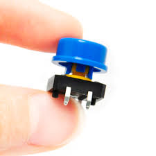
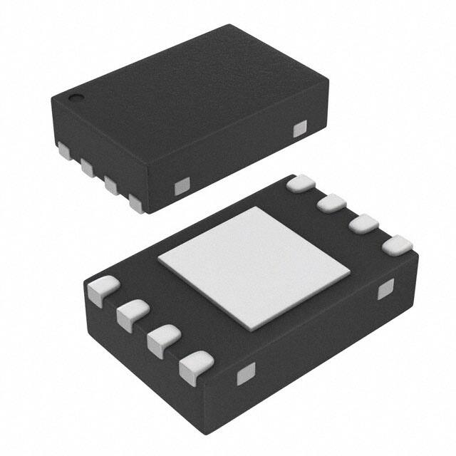
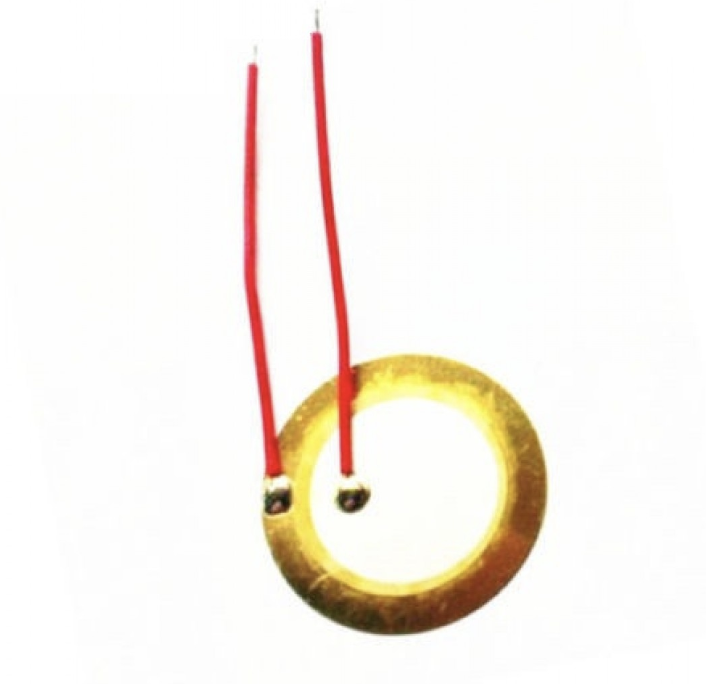
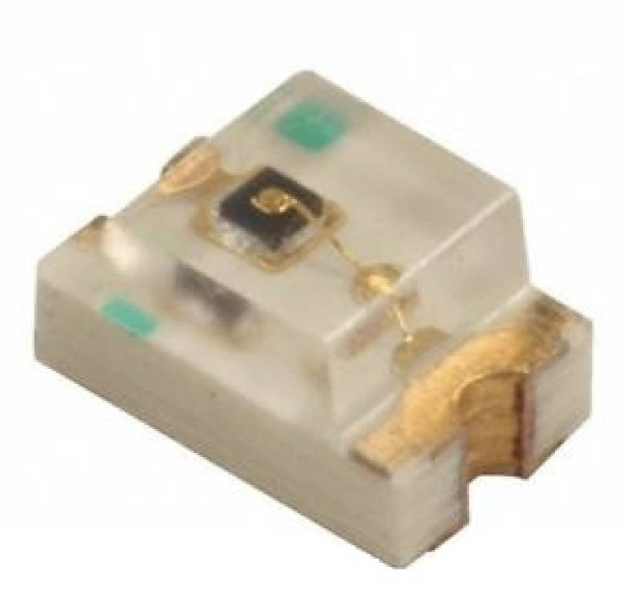
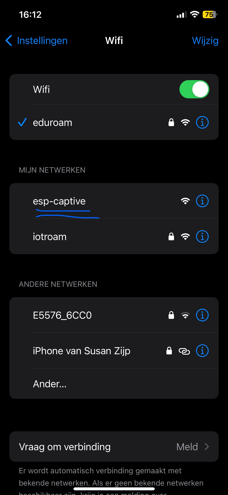
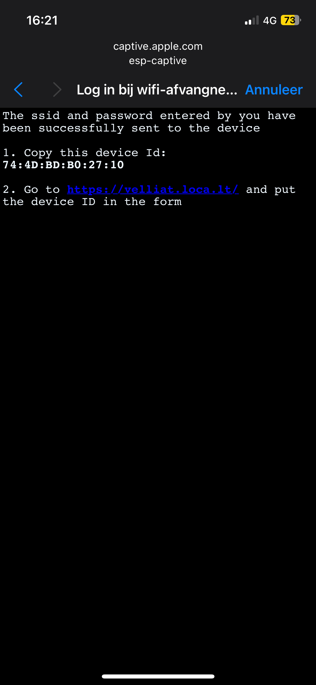

# Requirements

To build your embedded device you need to have a clear idea of the requirements. On this page you can describe the requirements of your embedded device. This includes the requirements from DLO, but also your own requirements.

Add some images! 😉

## **Device requirements**
|**Requirement ID#**|**Requirement**|**MoSCoW**|**Compliant**|
|---                |---            |---        |---         |
|EMBRQ#01|The embedded device acts as a client and sends measured sensor data to the application backend over http(s)/MQTT(tcp).|MUST|YES|
|EMBRQ#02|The embedded device also acts as a client receiver and receives status messages from the application backend over http(s) or MQTT.|MUST|YES|
|EMBRQ#03|The embedded device contains at least two types of input sensors (e.g. LDR, buttons, joystick, capacitive touch).|MUST|YES|
|EMBRQ#04|The embedded device contains at least two types of visual and/or sensory outputs (e.g. LED, LED Matrix, 7-segement display, motor, servo, actuator, LCD-screen, buzzer, etc).|MUST|YES|
|EMBRQ#05|The embedded device uses the WifiManager for configuration of SSID and password (PWD) for connecting to the network.|MUST|YES|
|EMBRQ#06|The embedded device is portable and does not require any cables while in use.|SHOULD HAVE|YES|


### Requirement 1 
For this requirement I used MQTT as communication protocol to connect the iot device to a web-app. The web-app and the IoT-device both are a client on my MQTT broker made inside of the projects docker container.

The IoT-device publishes sensor data on a specific topic on which the web-app is subscribed. Under here you can see the declarations for the MQTT client on the IoT-device. The device publishes data on the "cubice/(device_id)/web" topic.
there is no use of secure communication because of the difficulty of figuring out how to tunnel the broker from out of my local Docker container.
```
// MQTT broker details
const char* mqtt_server = "172.20.10.13";
const int mqtt_port = 1883;
const char* mqtt_username = "iot-dice";
const char* mqtt_password = "7YKyE8R2AhKzswfN";
const char* mqtt_sub_topic = "cubice/+/dice/#";
const char* mqtt_pub_topic = "cubice/+/web/";
```
The next part of code that is presented sits inside of the callback function of the MQTT loop. If the received message on the subscribed topic is equal to "roll" or "battery", A response has to be send with the device data. This code could be improved by processing the data calculation outside of the callback function and just call a global variable where the data is already stored. But sins this is a single thread code I just did it this way.
```
   else if (subtopic == "roll") { 

    char replySuffix[] = "rolled";
    char* replyTopic = mqttReplyTopic(mqtt_pub_topic, replySuffix); // replyTopic =  "cubice/+/web/rolled"


    piezo.melody(COUNT_DOWN); // play melody countdown 
    // blink(10,5000);

    int roll = detectDiceFace(); //get rolled value

    char payloadBuffer[5]; // Buffer to hold the converted string
    sprintf(payloadBuffer, "%d", roll); // Convert dice value to string

    //give dice value to web
    client.publish(replyTopic, payloadBuffer);
    LOG_PRINT("rolled number: ");
    LOG_PRINTLN(roll);
   
  } else if (subtopic == "battery") {
    ///make topic-name, mqtt_pub_topic = "cubice/+/web/"+"battery"
    char replySuffix[] = "battery";
    char* replyTopic = mqttReplyTopic(mqtt_pub_topic, replySuffix);
    
    double percentage = getLipoFuel();
    char payloadBuffer[10]; // Buffer to hold the converted string
    sprintf(payloadBuffer, "%.1f", percentage); // Convert battery value to string

    //give dice value to web
    client.publish(replyTopic, payloadBuffer);
    LOG_PRINT(percentage);
    LOG_PRINTLN("%");
    
  }
```
### Requirement 2
This requirement goes together with Requirement 1. As a MQTT client this device can publish and subscribe in the same time. So to make use of that I used different topics for subscribing and publishing per functionality so that the message does not need any specific information.

The device listens on subtopics and if anything is received on that topic a callback is activated. The subtopics it listens to;  
- "areyouthere"  *(web-app looks if device is still subscribed)*
- "rolled"       *(web-app rolled the dice)*
- "battery"      *(web-app wants dice battery status)*

Just as seen in the code above in Requirement 1.
### Requirement 3 
The IoT-device consist of one tactile button a Inertial Measurement Unit (MPU9250) and a MAX17043 host-side fuel-gauge systems fot lithium batteries. The button used in this project is used as a roll button when the device is not in a state where it connects to a web-app. Next to that it is also used in the start-up of the device. if the button is pressed it will reset the non-volatile storage for network preferences.
#### Button
```
   #ifdef USE_WEB
    preferences.begin("network", false); // Open NVS with the namespace "network"

    if (digitalRead(BUTTON_PIN) == LOW) {
        delay(500);
        // Button has been pressed for 5 seconds
        LOG_PRINTLN("Button pressed for 5 seconds. Clearing network data...");
        preferences.clear(); // Clear all preferences in the "network" namespace
        LOG_PRINTLN("Network data cleared.");
    }

    setNetwork(preferences);
```




#### IMU

The MPU9250 IMU sensor is used to detect the face that the dice is thrown on by using accelerometer data. this IC can be used for more like reading the real-time orientation if the IoT-device, but for the requirements of the product this is not necessary. 
```
void updateAccelerometer(){
    if (mpu.update()) {
        acc.x = mpu.getAccX();
        acc.y = mpu.getAccY();
        acc.z = mpu.getAccZ();
    }
}

int detectDiceFace() {
    updateAccelerometer();
    // This function returns the local maximum which is the constant gravitational pull when standing still
    float max = fmaxf(fabsf(acc.x), fmaxf(fabsf(acc.y), fabsf(acc.z)));

    //This part check on which axis the constant gravitational pull lies and returns the face.
    if (fabsf(acc.x) == max) {
        return acc.x > 0 ? 3 : 4;
    } else if (fabsf(acc.y) == max) {
        return acc.y > 0 ? 2 : 5;
    } else {
        return acc.z > 0 ? 1 : 6;
    }
}
```


#### Fuel-Gauge

The MAX17043 is a fuel-gauge IC that is used to measure the relative state of charge in a LiPo battery. it has some added functionalities like; 
- sending a alert signal if the charge goes below a users set-point
- create a hardware reset on I/O input.
- Integrated Calculation from ModelGauge Algorithm

```
	// Quick start restarts the MAX17043 in hopes of getting a more accurate
	// guess for the SOC.
	lipo.quickStart();

	// We can set an interrupt to alert when the battery SoC gets too low.
	// We can alert at anywhere between 1% - 32%:
	lipo.setThreshold(20); // Set alert threshold to 20%.


bool batteryLOW() {
    alert = lipo.getAlert() ? true :false ; 
    lipo.clearAlert();
    return alert; 
}

double getLipoFuel(){
    return lipo.getSOC();
}
```




### Requirement 4 
The device has 2 outputs a Piezo buzzer and a blue LED. which are connected trough the same PWM channel on the ESP32C3. So that they can be used at the same time in this single threaded program.

#### Piezzo Buzzer



#### Blue LED


```
void blink(int numBlinks, int totalDuration) {
    // Calculate the duration of each blink interval
    int blinkInterval = totalDuration / (2 * numBlinks);

    // Set up LEDC for PWM control
    ledcSetup(0, 12000, 8); // Channel 0, 12 kHz PWM, 8-bit resolution
    ledcAttachPin(LED_PIN, 0); // Attach LED pin to channel 0 *** Notice, Same LEDC-CHANNEL as the piezo buzzer


    // Store the current duty cycle value before changing it. 
    int originalDutyCycle = ledcRead(0); 

    // Blink the LED for the specified number of times
    for (int i = 0; i < numBlinks; i++) {
        // Turn the LED on
        ledcWrite(0, 255); // 100% duty cycle
        delay(blinkInterval);
        // Turn the LED off
        ledcWrite(0, 0); // 0% duty cycle
        delay(blinkInterval);
    }
        // Restore the LED's duty cycle to its original value
    ledcWrite(0, originalDutyCycle);

}

```
I created a class for the Piezzo, both the Piezzo and LED are or channel 0.
```
class PiezoPlayer {
  public:
    PiezoPlayer(int pin, int channel);
    void melody(MelodyID MelodyID);
    void setTempo(int tempo);
  
  private:
    void _play( int melody[], int songLength);
    uint32_t _calculateFrequency(uint32_t targetFrequency);
    int _buzzerPin;
    int _tempo;
    int _wholenote;
    Tone32 _tone32;
};

```

### Requirement 5
I want the user to be able to operate the IoT device without connecting any wires or cables to it. This also means that during setup the device has to be connected to a WiFi network wireless. This is done by using a captive-portal and teh usage of non-volatile storage to set the Wifi ssid & password, and to store it even after the powering of the device.

For this case I made a Class in my project called Captive-portal which starts up an WiFi access-point and sends a html/css page to any device that connects to the access-point. This way the user can connect to the IoT-device without WiFi and give their WiFi name and password to the device.   




The page that is send after connecting to the access-point is where the user can fill in his Wifi ssid & password.


After the form is filled in the access-point closes and the user is informed to safe the device id for usage in the web-app. 



I created a class for the captive portal
```
class CaptivePortal {
public:
    CaptivePortal();

    static const char network_html[];
    String  MAC;
    String network_name;
    String network_password;
   
    void begin();
    bool submissionComplete();
    void setupHandlers();
    void closeAPAndServer();


private:
    DNSServer dnsServer; 
    AsyncWebServer server;
    bool name_received;
    bool password_received;
    bool completedSubmission = false;

    void setupServer();
};

class CaptiveRequestHandler : public AsyncWebHandler {
public:
    CaptiveRequestHandler();
    bool canHandle(AsyncWebServerRequest *request);
    void handleRequest(AsyncWebServerRequest *request);
};

```

### Requirement 6 
A reason why i chose for the Beetle ESP32C3 from DFRobots is that it has a build in Li-ion battery charging management function for directly connecting a LiPo battery to the micro-controller. Because the ESP32 needs a reliable 3.3v power supply without this it wouldn't be possible. So to make the device portable a 250mah 3.7v LiPo battery is added to the device that is capable of powering al the components. We wouldn't want to have to take the battery of the device while not in use so instead a power switch is implemented to cut of the power supply when the device is not in use. 


<video width="400" controls>
    <source src="../assets/embedded/espWithBattery.mov" type="video/mp4">
</video>