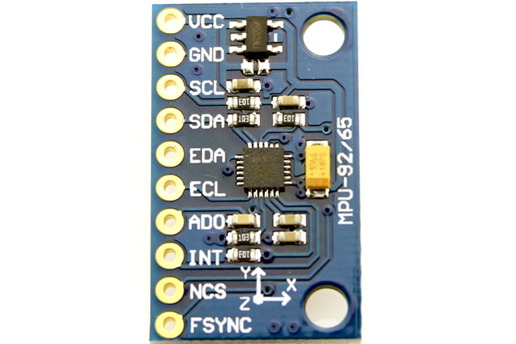
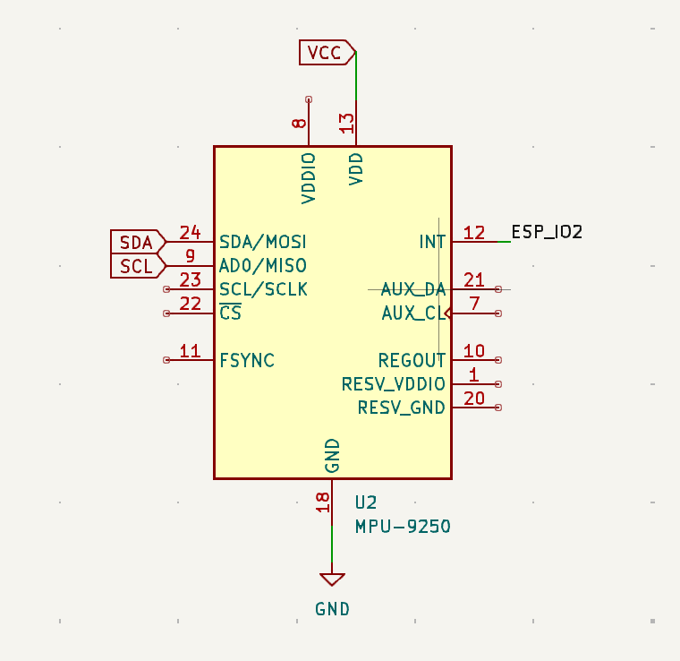
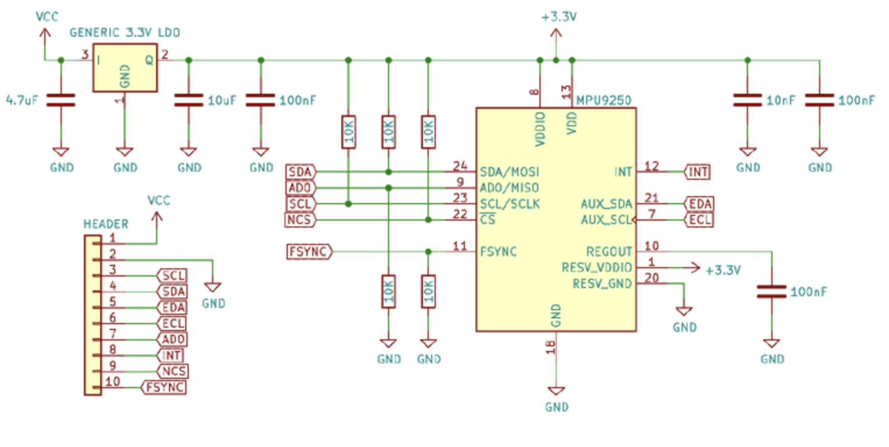
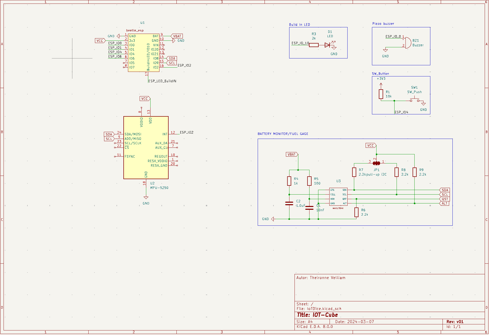
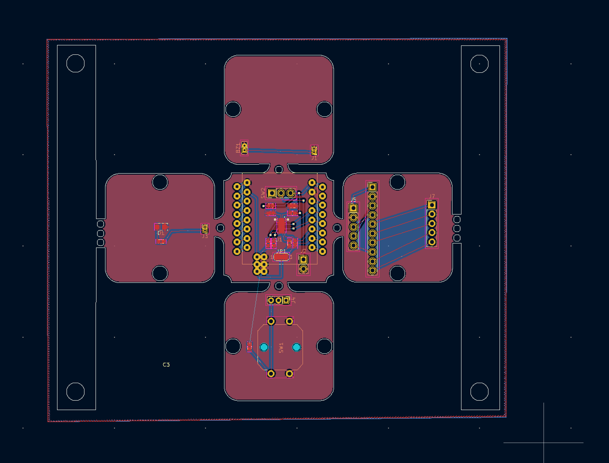
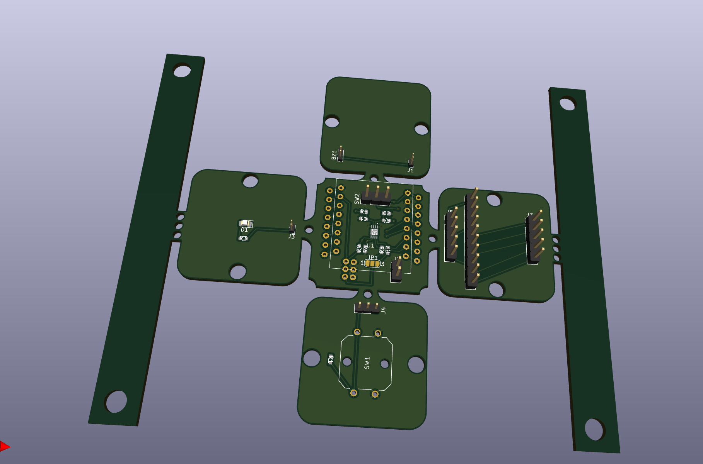
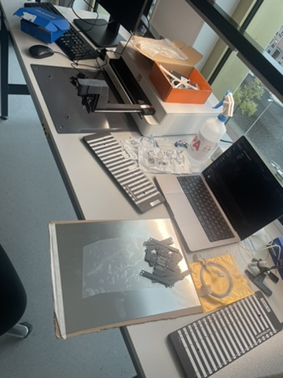
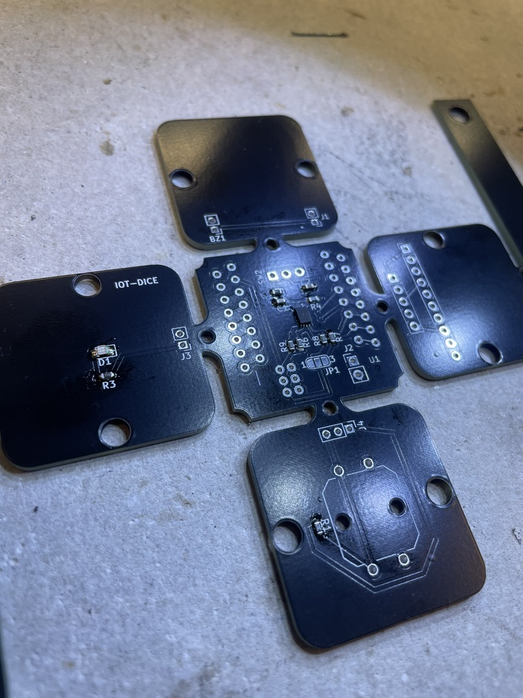
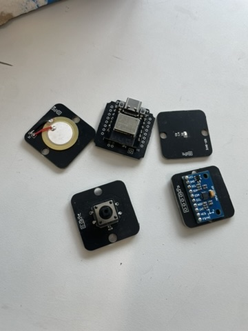

# Learning journal

Your learning journal can be seen as a diary of your learning process. It is a place where you can reflect on your learning, and where you can keep track of your progress. It is also a place where you can keep track of your questions, and where you can write down your answers to those questions.

So for example when you receive feedback on your project, you can write down the feedback and your reflection on it in your learning journal. You can also write down what you have learned from the feedback, and how you will apply it in your project.

# Intro 
This project is a remake of an previous IoT-project that I have build in 2022. That's why my journal will not start from the beginning but will have new insights on findings and new gained feedback on the project.

# MCU 
The micro-controller development board that i'm using for this project is the Beetle ESP32C3 from [DFRobots](https://wiki.dfrobot.com/SKU_DFR0868_Beetle_ESP32_C3).

This is a small single processor coin-size board of 25*20.5 mm. Its mini size effortlessly integrates into a miniature devices and offering both powerful functions and connectivity. 

The Wemos D1 mini ESP8266 was recommended but I chose for the Beetle ESP32 because of multiple reasons. 

1. The Beetle ESP32C3 was a easier aces sinds I already had this device at home. I also had a Wemos D1 but that one broke down.  

2. The Beetle ESP32C3 is smaller than the WEMOS D1, This makes the possibilities of minimizing teh size of the device greater.

3. The ESP32C3 features a newer microcontroller architecture compared to the ESP8266, potentially offering better performance in terms of processing power, speed, and efficiency.

4.  The ESP32C3 offers additional features such as improved power management, more GPIO pins, enhanced security features, and support for Bluetooth Low Energy (BLE), which the ESP8266 lacks.

5. The Beetle ESP32C3 development board of DFRobots comes with a on board li-ion battery charging management function. which is handy for projects like this.

# battery choice 

# Battery management systems
I'm trying to create a portable device that has no wires connected. Therefore i'm using a lithium battery. As earlier described i'm using a lithium battery of 250mah. These batteries are very small so the device has a short life cycle. This may hinder the user experience due to sudden shutdowns. To prevent this A battery monitor/management component has to be integrated in the IC of the device. 

My first possible way i stumbled on is a [voltage divider](https://en.wikipedia.org/wiki/Voltage_divider)  .  This is a passive linear circuit that produces an output voltage (Vout) that is a fraction of its input voltage (Vin). Because a lithium battery has a nominal voltage of 3.7v you can not connect it directly to a ADC input pin of the Beetle ESP32. The voltage divider helps with this by lowering the voltage so that it fall in between the range that the microprocessor can handle.

This would help with measuring the battery capacity and is very easy to implement. But after further research I came to the conclusion that this isn't enough. The reason why is that battery cells don't discharge in a linear way and temperature of the cell also has influence on how fast the battery is draining. For this reason only using a ADC and creating a algorithm for measuring the capacity would make the readings inaccurate. 
So the next step is to look for other solutions.

On further research I could make use of a battery management, monitor or fuel gage IC/microprocessor. These components are often used in more professional devices that uses a battery pack, like smartphones, e-bike, action cameras etc.

The 3 ICs on which im reading the documentation right now are the; 
- [MAX706-CSA](https://www.analog.com/media/en/technical-documentation/data-sheets/max705-max813l.pdf) 
- [MAX17043](https://www.analog.com/media/en/technical-documentation/data-sheets/max17043-max17044.pdf)
- [MAX DS27404](https://docs.rs-online.com/ceb0/A700000006834557.pdf)

all of these are created by the same fabricant Maxim Integrated MAX. 
### Comparison
**1. MAX DS27404:**

The MAX DS27404 is a standalone battery fuel gauge IC designed for single-cell lithium-ion or lithium-polymer batteries.
It provides accurate state of charge estimation, voltage, and current monitoring, as well as temperature compensation for improved accuracy.
The DS27404 also includes additional features such as support for external temperature sensing, programmable alert thresholds, and optional authentication for enhanced security.
This IC offers communication interfaces like I2C or SMBus for easy integration with microcontrollers like the ESP32C3.
The DS27404 is suitable for applications requiring precise battery monitoring and management.

**2. MAX17048:**

The MAX17048 is also a battery fuel gauge IC designed for single-cell lithium-ion or lithium-polymer batteries.
It offers accurate state of charge estimation, voltage, and current monitoring, as well as temperature compensation for improved accuracy.
The MAX17048 is optimized for low-power applications and provides features such as a low-power alert mode and programmable low-battery alert thresholds.
This IC also supports communication interfaces like I2C for easy integration with microcontrollers.
The MAX17048 is suitable for applications requiring accurate battery monitoring and efficient power management.

**3. MAX706-CSA:**

The MAX706-CSA is a voltage supervisor IC primarily used for monitoring system voltage levels and generating reset signals.
It is not specifically designed for battery monitoring and does not provide the sophisticated fuel gauging capabilities of the other two ICs.
While the MAX706-CSA could be used for system voltage monitoring, it would not offer the comprehensive battery monitoring features required for accurate capacity estimation and battery health monitoring.

**Reasons to Choose MAX17048 (over MAX DS27404 and MAX706-CSA):**

The MAX17048 offers specific features tailored for battery monitoring, including accurate fuel gauging, low-power operation, and support for low-capacity lithium batteries like my 250mAh lithium battery.
It provides comprehensive battery monitoring capabilities while remaining power-efficient, making it suitable for IoT devices.
The MAX17048 is designed for integration with microcontrollers and offers communication interfaces like I2C for easy interfacing with your ESP32C3.
It is well-suited for applications requiring precise battery monitoring, efficient power management, and reliable performance over the battery's lifespan.
In summary, the MAX17048 stands out as the optimal choice for this project due to its specific features, compatibility with the requirements, and comprehensive battery monitoring capabilities.

# PCB design

In my [BOM Embedded](./embedded/WiringDiagram_BOM.md) you can see the electrical components that i'm using for my pcb design. 

## MPU-9250 IMU

Because the mpu-9250 that i'm using is already on a module it has its own schematic. I coppied this schematic of [components101.com](https://components101.com/sensors/MPU9250-9-dof-mems-sensor-module-datasheet-pinout-features-working) to clarify and better visualize the project schematic.

The first schematic that I made only shows the mpu-9250 mcu itself and not the whole IC of the module that it is laying on. After reflecting I changed this to the new schematic to better describe the component in the schematic. 

**MPU-9250  module:**

**Old schematic:**

**New schematic:**

## MAX1704x 
For monitoring the battery fuel I will make use of the [MAX17043](https://www.analog.com/media/en/technical-documentation/data-sheets/max17043-max17044.pdf). This is a fuel-gauge IC that can monitor the current-drain and voltage drop. The data can be read out by I2C. to implement this IC in my project I chose to copy the schematic of Sparkfun. [here!](https://cdn.sparkfun.com/assets/6/5/6/b/b/20680-SparkFun_Lipo_Fuel_Gauge-Schematic.pdf) 

Instead of buying the [LiPo Fuel Gauge (MAX1704X)](https://learn.sparkfun.com/tutorials/lipo-fuel-gauge-max1704x-hookup-guide/all) from Sparkun I will try to make it myself. the reason for this is the size of the board. It is to big for the Cubice project requirements that im working on.

## testing Piezo

## v1 PCB schematic

## v2 PCB schematic

## Layout PCB

### 18-03
I finally made the full design of my pcb an ordered it! I send the gerber files to a manufacturer, JLPCB.

## Database
## 21-3
I created a new database for the application. before i used my old database but because the data that i want to store has slightly changed i decided to create a new one. 
It's been a long time sins I created a database so i strat by refreshing my knowledge on how to use phpMyAdmin and SQL.
I created the database and added new tables. 

I want to created a website where you can join a session of dice rolling with a dice device. Therefore i created a table for dice that holds the data of the dice, a session that holds the session id and name, and a participant that hold the participant of each session. 

## Soldering 
Time to solder the components on my pcb. I'm using 'surface mound device' components. components are quiet small so to put them on the board I used a surface mount component placer. 

I also ordered a stencil for the soldering paste.

In this video i'm placing the small components like resistors, LED and the MAX1704x on the pcb.

In the picture below you can see the results of soldering the components. 

After i soldered all the parts that are surface mounted i soldered the trough hole components, like the esp32, MPU9250, and the button and piezo.

## test battery 

## installing 

## TPU lijm 

>**click [here](https://remon-techniek.nl/wp-content/uploads/2023/12/IT001-FT-EN.pdf) for product information.**

| Product                               |Prijs      |
|------------------------------------------------|------------|
| IT3 PVC lijm THF blik 0.25 ltr                                      | € 6,73 |
| Verzending                                     | € 6,19     |
| BTW                                          | € 2,71     |
| Totaal  | € 15,63        |

## product modeling & Printing

