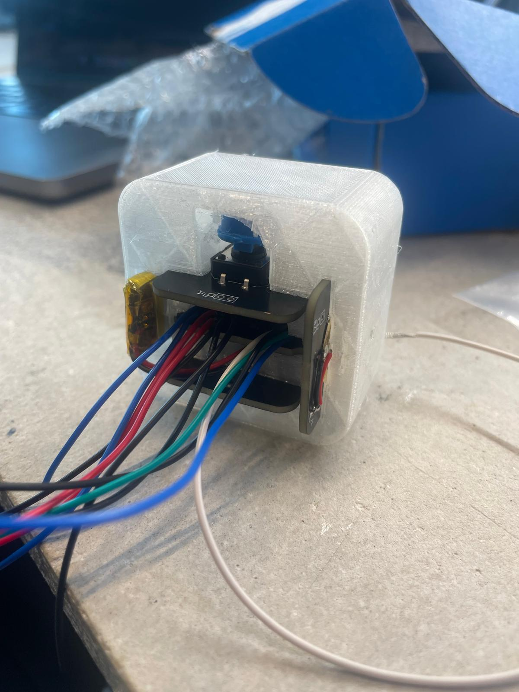

# Evaluation of FDM Filaments for Durable and Reliable 3D Printed IoT Dice

## Table of Contents
> 1. [Abstract](#abstract)
> 2. [Introduction](#introduction)
>       1. [What is 3D printing](#what-is-3d-printing)
>       2. [3D Filament](#3d-filament)
>       3. [Choice of Filament](#filament-characteristics)
>           - [Requirements](#requirements)
>           - [Filament Characteristics](#filament-characteristics)
>           - [Chosen Filament](#chosen-filament)
>       3. [Modeling & Slicing](#modelling--slicing)
> 4. [Method](#method)
>       1. [CAD Tool](#cad-tool)
>       2. [Slicing Tool](#slicing-tool)
>       3. [3D Printer in Use](#3d-printer-in-use)
>       4. [Printed Filament](#printed-filament)
>       5. [Test](#test)
> 5. [Results](#results)
>       1. [CAD Model v.1](#cad-model-version-1)
>       2. [Printing PETG](#printing-petg)
>       3. [PETG Results](#petg-test-results)
>       4. [CAD Model v.2](#cad-model-version-2)
>       5. [Printing PETG](#printing-tpu)
>       6. [PETG Results](#tpu-test-results)
> 6. [Conclusion](#conclusion)
> 7. [Recommendation](#recommendation)
> 8. [References](#references)
> 9. [Glossary](#glossary)
## Abstract
This study explores the options of 3D filaments that can be used on a *Fused Deposition Modelling (FDM)* 3D printing to create a durable dice case for an *Internet of Things (IoT)* device. This device has prerequisite goals such as being able to throw the device and therefore needs a reliable casing that protects the electrical components.  Emphasis is placed on the mechanical durability, the ease of printing, and the ease of fitting electrical components into the casing of the device.

## Introduction
This study has come to be thanks to a *IoT dice* that I am working on, this is a smart dice that uses sensors and actuators to indicate the face that it has been rolled on. The smart dice has prerequisite design goals that require the device to be a rollable and throwable object. This brings some complications because the device exists out of multiple electrical components such as an embedded-system, Lithium-ion battery, and wiring cables. These components need careful handling to prevent damage and therefore the smart dice has a high risk of breaking in a smart dice that can be thrown against the wall for example. 

To prevent this from happening while sticking to the design goals, the electrical components of the device must be compactly cased with a durable material that can reliably withstand a punch. Because I don’t have a lot of expertise in physical design and materials, I chose to create my casing with a 3D printer. This is a beginner friendly way of creating physical objects without much expertise. Second reason for creating the casing on a 3D printer is the lack of resources so doing it another way would cost this research a lot more money.

The goal of this study is to find the filament that would best suit this smart dice needs. To accomplish this, I will test some of the optional filaments and do some literature research about the materials and ease of printing. This study can be of help for creators with likewise projects that look for an advice or are in search for a filament that they can use in their project. 

### What is 3D printing

To further explain more about the types of filaments that is tested on I first must explain what 3D printing is and the 3D printer type that will be used.  3D printing or *additive manufacturing (AM)* is a process for making a 3D object of any shape from a 3D model or other electronic data sources through additive processes in which successive layers of material are laid down under computer controls. \[[1](#references)] These computer controls are executed by a 3D printer. In the commercial field there are two usual techniques for printing the 3D model, *Fuse Deposition Modeling (FDM)* & *Stereolithography (SLA)*. 

FDM printing is the most widely used way of 3D printing. A thermoplastic filament is inserted through a hot nozzle that is actuated by electrical motors in 3 axes to lay the filament on top of a print bed layer by layer.  SLA printing is a 3D printing method that uses a UV laser to cure and harden liquid resin in a tank, building objects layer by layer. 

> ***click on the image for further explanation!***

As you may already tell this study is focused on FDM printing and the plastic filament used for it. There are some advantages and disadvantages compared to a printer with SLA technology.
>When *additive manufacturing (AM)* processes produce parts layer by layer, each layer also introduces an opportunity for inaccuracy. The process by which layers are formed affects the surface quality, level of precision, and the accuracy of each layer, and consequently, the overall print quality. 
FDM 3D printers form layers by depositing lines of molten material. With this process, the resolution of the part is defined by the size of the extrusion nozzle and there are voids in between the rounded lines as the nozzle deposits them. As a result, layers may not fully adhere to one another, layers are generally clearly visible on the surface.
In SLA 3D printing, liquid resin is cured by a highly-precise laser to form each layer, which can achieve much finer details and is more reliable to repeatedly achieve high-quality results. As a result, SLA 3D printing is known for its fine features, smooth surface finish, ultimate part precision, and accuracy. \[[5](#references)]

The advantages of using a FDM printer is that printing with this technologies cost less, has a faster printing time and the resources to use these technologies is already in hand. there is a broad selection of filament to choose from for different applications which are relatively cheap. Printing with a FDM printer can also be done faster and efficiently because of the fast movement of the nozzles and de bigger volume size on which a object can be printed on.\[[2](#references)]

Because the device the device that i'm working on is still in the early stage of prototyping and testing these are benefits that are highly valued. Next to the fact that the resources to use these technologies is already in hand.   

### 3D Filament 
3D filament refers to the thermoplastic material used to create three-dimensional objects. This filament is fed into an FDM printer, where it is heated to a molten state and extruded through a nozzle. The printer lays down this material in successive layers, following a predetermined path based on a digital model, to construct the final object. 

For applications such as the smart dice casing, the choice of filament is crucial due to its direct impact on the mechanical properties of the printed object. Filaments vary in composition, each offering different characteristics such as durability, flexibility, and resistance to impact and temperature. Common filament types include *PLA (Polylactic Acid)*, *ABS (Acrylonitrile Butadiene Styrene)*, *PETG (Polyethylene Terephthalate Glycol)*, and *(TPU)Thermoplastic Polyurethane*, among others. Each type has specific benefits and drawbacks, making the selection process vital to make sure that the final product meets the necessary functional requirements of the IoT device.

There is a great amount of filaments available, I have opted to narrow down the selection to a small, manageable group of filaments that are both common and readily available. This will facilitate a focused analysis and ensure practical applicability for similar projects. The selected filaments are:

- **PLA** (Polylactic Acid) - Known for its ease of use and good surface finish.
- **ABS** (Acrylonitrile Butadiene Styrene) - Valued for its toughness and heat resistance.
- **PETG** (Polyethylene Terephthalate Glycol) - Appreciated for its strength and water resistance.
- **TPU** (Thermoplastic Polyurethane) - Preferred for its flexibility and durability.
- **Nylon** - Chosen for its strength and abrasion resistance.

[[6](#references)]

### Choice of Filament 
The differences in these filaments comes down to the characteristics of the material. For the smart dice casing I am looking for specific properties like durability, impact resistance, heat tolerance, and ease of printing. As I assess the four commonly used materials: PLA, ABS, PETG, TPU, and Nylon a determination will be made to decide which material will be used during creation.

#### Requirements
|                   |                      |
|----------------------------------------|---------------------------|
| **Durability**                      |  The material should have a high durability to withstand stress or abrasion that is put onto the smart dice to protect the electrical components.                           |
| **Impact Resistance**               | The material should have a high impact resistance to withstand big drops of throws from a smart dice user.                    |
| **Ease of Printing**                |  The ease of printing should be on a beginner level considering this project the smart dice should be replicable. |
| **Heat Resistance**                 |  The material should withstand a medium amount of around 60°c and above because of the electrical components that can warm up to this temperature.       |
|

#### Filament Characteristics

|PLA                    |                      |
|----------------------------------------|---------------------------|
| **Durability**                      |  **Medium** PLA is fairly strong but can be brittle, which limits its use in applications requiring high durability                           |
| **Impact Resistance**               | **Low** Due to its brittle nature, PLA is not ideal for objects that are prone to impacts or drops.                   |
| **Ease of Printing**                | **High** PLA prints at lower temperatures and does not require a heated bed, making it very beginner-friendly. It experiences minimal warping.                    |
| **Heat Resistance**                 | **Low** PLA deforms at temperatures around 60°C, making it unsuitable for high-temperature environments.                       |
|

|ABS                    |                      |
|----------------------------------------|---------------------------|
| **Durability**                      | **High** ABS is very tough and suitable for parts requiring rigidity and strength.                             |
| **Impact Resistance**               | **High** It offers excellent resistance to physical impacts, suitable for protective gear and functional parts.             |
| **Ease of Printing**                | **Low** ABS is prone to warping and requires a heated bed and controlled printing environment.                    |
| **Heat Resistance**                 | **High** ABS withstands higher temperatures than PLA and TPU, making it ideal for parts exposed to high heat.                       |
|

|PETG                    |                      |
|----------------------------------------|---------------------------|
| **Durability**                      | **High** PETG is tougher and more flexible than PLA, making it suitable for durable parts.                  |
| **Impact Resistance**               | **Medium** It offers better impact resistance than PLA, though not as high as TPU or ABS.                   |
| **Ease of Printing**                | **Medium.** PETG requires higher temperatures than PLA but is generally less prone to printing issues like warping compared to ABS.                    |
| **Heat Resistance**                 | **Medium-High** PETG can withstand higher temperatures than PLA, making it suitable for moderately high-temperature applications.                       |
|

|TPU                    |                      |
|----------------------------------------|---------------------------|
| **Durability**                      | **Very High** TPU is highly flexible and resistant to abrasion, making it extremely durable.                              |
| **Impact Resistance**               | **Very High** The flexibility of TPU allows it to absorb impacts exceptionally well.                 |
| **Ease of Printing**                | **Low** TPU can be challenging to print due to its flexibility, requiring specific printer settings and potentially a direct drive extruder.                   |
| **Heat Resistance**                 |  **Low to Medium** TPU can handle low to moderate heat but is not suitable for high-temperature applications.                       |
|

|NYLON                    |                      |
|----------------------------------------|---------------------------|
| **Durability**                      | **Very High** Nylon is known for its strength and durability, making it ideal for parts that require robustness. warping.                              |
| **Impact Resistance**               | **High** Nylon has good impact resistance, which is beneficial for parts under mechanical stress.                   |
| **Ease of Printing**                | **Low** Nylon is more difficult to print than PLA and PETG due to its sensitivity to moisture and higher temperatures needed.          |
| **Heat Resistance**                 | **High** Nylon can withstand higher temperatures, making it suitable for applications that involve heat exposure.                       |
|
> ***Sources:*** [[1](#references)], [[6](#references)], [[7](#references)], [[8]()]

#### Chosen filament

PETG emerges as the strongest contender for printing a smart dice, balancing the ease of printability with a higher durability and heat resistance than PLA. Without the print complexity and ventilation needs of ABS and NYLON. The light flexibility and strtong impact resistance that PETG has will protect the internal components from typical handling and usage in games.

However, TPU and Nylon also offer compelling characteristics for this use case. TPU, known for its flexibility and impact resistance, could provide additional protection against drops and rough handling. Its ability to absorb impacts could be vital in preserving both the structure and functionality of the embedded electronic components within the dice.

Nylon has more durability and a higher impact resistance. It withstands mechanical stress and high temperatures better than many other filaments, making it suitable for objects that might experience varied environmental conditions.

Both TPU and Nylon could be considered as the material to use for the smart dice application, but PETG is easier to print so that is the ultimate reason why I chose this material. 

## Modelling & Slicing

Modeling and slicing are fundamental steps in the preparation for 3D printing the smart dice casing. Modeling refers to the manual modeling process of preparing geometric data for 3D computer graphics. This can be done using a *Computer-Aided Design (CAD)* software. This digital model encapsulates all the physical geometries of the final product. The model must be well designed so that it not only fits the components snugly but also holds on to the durability and impact resistance requirements of a device that will be thrown frequently.

Slicing is the process that converts the 3D model into a series of thin layers and generates a specific path for the 3D printer's nozzle to follow. This is done through slicing software, which takes the CAD model and "slices" it into layers, producing a file known as G-code. The G-code contains detailed instructions for the printer, such as where to start and stop extrusion of the filament and at what speed and temperature to operate. The precision of the slicing process is crucial as it directly influences the quality, strength, and accuracy of the printed object. This can be optimized by parameters like layer height, infill density, and printer speed. The properties of the filament material matters in this factor because different materials have different characteristics such as the melting temperature.

##  Method

### CAD Tool

For creating a 3D model, I used two different CAD software applications. Both these tools can be downloaded and used as of now with a free subscription plan. Although this free plan comes with limited functions, it still provides sufficient capabilities to design a 3D model of a dice.

  
  <img src="data:image/png;base64,iVBORw0KGgoAAAANSUhEUgAAAOEAAADhCAMAAAAJbSJIAAAA+VBMVEUdTv////8dT/7///3//v////n///sNR/97kusAQv67x/MYS/95j/gLSfn2/vo7YPBQc+YAP/YfUPb0+vyQo/X///bc6P0bUPxBZ+7///P6/////PgAOfoSSf8APvb6//np8/nb6Pfv/voAQPDR5PYgTe8XReaGmPHy9/Vlg+7Dz/BMauW5y/Ogtu9YdO1Zd+rP2fc5Xe6LpvDp7/kAQ+1sh+KwwPY2Ve6lsPV+kvVuiNrW3vkAM/QyVd14l+m80O/e8PmqtvOLpeZRc/KmwO3p5/pUd+OJovFjft+2wvRDYtacqPSDluslTec5XfZzlOBjgPdJbNlPZ/kYuZvZAAAQT0lEQVR4nO2di1vayBbAk3nFGBOapONAIBAEWqHgA1DrsqtW3bq9re7u/f//mDsTUMNTEpJIuJyqX78+MvPjzOOcmXNOJGmzBYD37kHSsiXMvmwJsy9bwuzLljD7siXMvmwJsy9bwuzLljD7siXMvmwJ425OkpiisTTbTZEQcJEspbHzyeWkWnrNptWST+jqnw9htemm2myaTanNOiGQVlpf1E0bpXxUMqbm2jKEDpYRdDoN12JMElMy6aZT+iyZpdQ6NpGHgopFb6fkMstKvuW0CBVzx5MLlRFhxZExrR+VXZZ9HY6ebx6fEExk9KxDPloRltv+dEy4C4kTMv6lnu4iAp/xXgXanQafidkm5C0ota5NCIVTgHw6yr0908o2IZD6Zz2IHTgDUIZ8sBYGeTPR3T8xQv+5TDK/nEBIEJkeooKQYyMin58qmpTYmpOcDsVWoF6cG3gmXFCw99FSEpuNyemQMaX24BUgqvDBuIAPyg7G+2dmUpt/coRa+ft+wV9AF/EJIZCbctc5NZnpmAwhA5KSvyZz0SDlc3BctVjmOwfw/Y94JSFCZn216fwJCBHiyw8kgT+Ri/Tws6lIsY/VRAjd2iWfgEGAyXGJqr9VOWZQqQgRXP/eB3GbqnETCvddPRpQ6MgQzx+lcP/3xi03TpFMhv+KK5T/Qkb7VJWkWNfVuAmBZj7uvrW0cPh9Eyh/tPkqyk1UHPwLp9N3xTyOr0exEnI38LFrIDyfbSR4v6wBqfR9AAtFFBjNDizA3o7uavGpMV5CrXZZlSmdPwFfdcgJGXDLVx6mgTWV8MFNyMlxTVs3Qu5C8ClY/tLC3IN/W4f+KPVbVxsdA1Yqz4xiC+F7qPPjQgExqTEmQk0Dmvrp3CgU3xygz4Sj/2mV8tfcOB2fuoQaH8tWPLMxJkIGtP7DAS0i0dc3F5ogIdd+6bhaHN87YbEo3zTLsRg5cemw1uT7m7C+0JuG9jihYNRqXU/4/+j5wyF8syGk3Yija6sTiifU8u2lRudMQiHqxbcChsgJqJ/IlVwcSoxDh0qtw32k+VboEoQS0PMt6NsIz48hsrEWhHwH7O8cYNlxjJUImQZqzZugo0zgOxMCf5HQgHm8z9cWB844aApDKHFz1DVv7VcL590JJbFFWHquTd+2YJYh9PtiPu0ahTUiBLr+01hu8VyKULKYVLsbrAeh+F9uudmjyKksZAlByK04IDG1Ozo3fldCwBgDyofBEnt7KB2KT079uA461DTJfPqBZx8RbgShpfcfbIKdqIBrTAiGP8xmlQqXfAMJ/Rlonl47NLr+1p1QUhvfHFxE0fW33oRA6T94wn8gb7rxGSTklqOk+iYa/1oNcE0JuYl22nai7xBrTwhc/YpgXFltiVlnQj4Hd/nsQwEPbuMI1d1QHtL/N6G8Jcw8ISLV3323fmMJZeR9N2cd+G4QIam0n/TptjeGEDmI0MNuWdlYwpF4ZzV9PJBm0wgxHNypYJMJHUgq909mYE3dCEKEXi5gKOKOmP1gKuA5en8DCKFMCyR4AeBQfNMsabwj2mYQyuIOLfAYSFARw+u8qo3OgLJPCO366AgL+t/8mRhi5/xUYZknFBEzGLfy5X+qBCMMqe9N+5OS/8a7MgUjU54JYeq3aysT4iIkvaYJmN7/bMsEjV14IASr30u8O0HCfMYIET7ocgZXYpL26ZtDSPDWynAgn445E6hZJBSR+SKL5PxCYQAMd3j1rkVI4EwS+XEmzreLUhYJCe99EZ/cjQXJun0R21CYuLmCf15lkhAh0turaeOhXMB97NqTR3cOLfRg9ggRtLsNneONNcYkoFj3ExfIjoOetZoNQhHOhTARIZWzkmMYK90NZGKglwfzmfn820wQihg3Ig++1+ZH/rq1qz8phs70CWUmCCGk1LvSXQbmd1VTGl9tPCPYNhuE1Ok8KkBaFBHLmKbmWnA6Gm7tCQmtyKS9VIoB0Erf62JLkYOXrhAZZzXdj15YKaopOR0iudosa0vFpTOgmFeeHxEdfEDBuL4zmcVW02RihNB70F2w3MfPGLP0RucAjydgIEKNzoW5YoJC/IRkGA97fqEu3bOh81vLtwjE2M9oGyIS/iDvwdRWyjOJn5Cb0ITU81FyfPp/9SAk46kmCFeP1OUG+5x+x04IKeydldwofZGU2oM9EeJRITJu5VZIUUyA0L7tuyxaOiFnfDpHfk7Uiw65V0UOO5Ya5Xn+M+MjFGkviMrtvJiAkYLJgH+McXSCEXZeVInE1JZ7O6rOJBDhc4uRkDuxBVw/VldNlRBZU3JxIrZdpvW7cqSdMU4dFrF3+bsGVt3ALKaXb42JzGiCETfgS++nQ8LNEWx3GtyJ11bN6PFjMJ9+ODJxCHqZkaSCoHHbGN7lhGkgHkK+NBDYirRDzBHNPB5ggmgloEqE5d4vf3cM86RYCDEm3ERT40yqA0A3dzyMglnuiGAI60clEGoaxEEIsXz4mX+28VXV8ddM0Le+OeNNCnsA7v6hhJmOqxIicc5knFuaCAqLNRFOfGBq7lpUm3jJ1eQq5V92V2QML/txrkpYKSJynS9FpHizTa3WrEOCxpwOvu/29szlg7lW1SG+2TNZYjnv3K/qf/ZoEQWCzSoQ4cLJh6kb8nn9XpHQ6bo6S6zsk6h7wpTHexgszCBsuiI1/lrS9I1MCIXg3QTLPbyKmT9BeCw3nG9OO0sqMSohNAimJ3flxMvLCGHckKsGzfE0CEVY005NFw9InpA3oTR+eukSQufrhSJJCVR5mCF8JWOamfvxOlDT0OF/StKjldwiOtU6kPTfLwswNUIoV74+qrFWBniref1018FJ6zAYv46ot9N3UyPk8/AQo2RHqaT+CBI63F6rH5kxm2rTYgkbVDP5WioHUiASIWRqm8pjgsjBrqVbSdaxEsYp0JT8gIxt+gnpsNSZuD8RVWYKXV2P2PvlhLtRFz8M4VTIiRNa/rYbuHv392Ba3RtuixEJ5vds+EOxuocEkYnL4mQI+XS3Ph7SqbozkJs2evyWDd8Dub3EfYtZ+TlJEUqS+/RjqmwCpJXzhhJ/UVnLkpSnFsWzitklR6hZ5Xx97O4d+uf4Bw+1uPdGxneITqVAkFOZcX2aFCE3nhgoXfagX7wSPbcmvNLqcRmA2Kw48ZDarwPeDpqZ6Z+cDoVoOuse8rkIK6+et0NwRVyHhjskWtAGM4/ri4qFJUkoLq3Np3sSnI188eEbh/HtUWGxlOoCylMbLyoWliihP99Y+agaTPES+5WDsfe3uHRaeZwqZpdQR5R0nZdEluwoHYpW+s0TBU2M10ARblfB/WNzpUM3vkPo+pk3V3kpEjKm9zsHpDheFQoXcPt0FXscAPVuMLPYafo6BExSc21jrLCXqHEi7g/1qPdPFp/hImR4HQiZ/20e8RWPvJhy4v6iguTqXlli4S5omF8Nxi13bcgXZrqYLx3CkYjbBVgsjLdP6Em+FK5Wt8Y74paaN/hNuLQJue/d6NiTFVxQQRbhsqGeo5Xz1xgXl6vGlCKhGFxq/npCh6Iy8uHH/rLH0pLwPk/vRQqNLL+9zKSsQ/EM12xW8ViZBRETA6vNsg7evnrnXbBc88qTxXReMos6ZUIuSn/SPfa70cqZ0ttOB5NKH6q4GCZFPH1C5u7NMCIdDDuPrjXyZed0QJLM02tuoDlhMv3fgVDfmS6Ixa1VSL1f+lwLAAgTW2ncil00XD2f9AklfW+OmYxx/R++O870HjXJ0so7NxEqGKwRIYRFWmlZpZk11xlT7+pyMUo5tHUiFNk/xu2nWXeMmrVLZYojFEp5V0JH9gqEyHh4G+aX+8RIvrnsS34+wnDZEee8buOnTQh0wsZWvzshkb//tEVAwVigCCyc3Jmvd1UaX5ua1aU29/UjRPKHUq4tQiheRh93HCvcseKG3IiQATPfwqsUC3tfHX7QdfNo349LfwkwFOYKtrul4fav9M8pXXRKsdaECH5wRcnBHQ/BKT/opmm6QNd/2fOrmWeFkOuJdQwyWTgZk+u78j91SsmK5dDeeR66/oMb5Xy7MrHXVYrIrhPCBy1eqVbRehByp1Zt7stF5/XwmCuYM4u3sqxYiWkdCEd/3L+yMd/zYqmftYaEIpBBbXQcOhnSvDGE4umAmXctecUKdutLOBTNPLuRkTgT31RCIMotHlC4xCsFMkqoMQso+rkRpWp0Ngj9Jljt6CSKn5QJwud/Uvu14YRAsuzNJtTYxYYT8saMuAgJIb/WkdCyVy8M6hvsog71WuowHkJfMN1gHfqAxL6LPVZ/bQiF7+V0GvHnzKwNoYNJ+8vyL4TMHCGCeNCsKSFim7NFCBG2P1quH72/gYSiGkHh3ApxsywkubO2GbIiIcLOIL98pYaRZIkQVs/KLHRoYBKER/M6EZUQQVghxL7tq9bCWjczJX5CGLMORZinuANpn4acgCNJYqX5d16Fh8g6RLD+oRSxs/ETUnKdU2c/OjyheBkfJHLvynTF0WSUF80mMEqJbHetmcH7oQlFEgKGo2JTESWJW25EaO+y5E7XBgpLCB1xAnmdC2HBTEsS94cQc/ft5N/a1LND6xDSSvW4zJYsxjRb4iOEo5A0PxYTY0LOL/x8Ie21iVCEhC+h2PtY9kNVU6mitPgx+iWGY9WPOKT30dSZFRiroQgNjJz7hrnye7rjIgT56njhPCIjiqvNkhYYYaEIkXydr8WQpBrXKLVA/8EO3nr6oQoQnuTV1xUnFGGvacaSFRdjzpnauDe4HomoJh9QZef15cXLEfIdwqGHt2Y0E2ZKYiS0JDPfEi7OWL1uir1fz6G0yxEa3ArdvZj9DpMIEiOhNnov97hCHELJ/ujlxcsRosLgLja+WAn9YCCX/bQxwsbLzT0kyBFms8qA9gYhX4sRRbJ3qceZshl/7qf62K5ANHmTVumIGm4LT/Uh4SYMPOh8cmNN14yfsAHMuwGdeLkeFHXA+uxg8fCE1GidihKCcWZrJpBrzoBeu7yZ6D2mCA+OF41SkY0+OC5LcZcSSSRDGQDF+mpjB8qvgTTiFQHOnDpT4hPgXvzhQy1cjsZy/UmmXgAAZq6NITaWC6QhxIHk24UerdriW12J/5mjLKbScZUs9zpkiGGh9bRM4kIESYjQ3zu0ftfzkyQXX26L7JM/mybQQCKlUhKtasGUP8R75RFewEj9ku1hEohCSrJ1O5im5luU0gWReqhI7p/UJCbgSBIlBIwBq9ysFhYE0uB63ky0zk2yo1QSi4de69p8Oo6V7hBzjxtphPT2SsMCJol1IpUyT+ppW6QdjCvPoRB7HWulU6ZlJA1C8ZrdowEdX20QQrCdU5KvpZUGoSXeVW6eiQTDwCgl+8cmYMlXQ0utWJek1L4W6bAyAeE/e3+bUSpih5f0CCXJzO1ibr/w/RE7HUtNqek0CfmS06wLwEr7v+achL34JUVCMekk/ZcHq3/1ddFuOoip6lDkpLuPO/0V7lkiNJkyIf/WZ2ZbJtdkuoTinV0plAMNSsqE79DmexCmK1vC7MuWMPuyJcy+bAmzL1vC7MuWMPuyJcy+bAmzL2BY3ThLsiWcIvwfCsVIzijdPosAAAAASUVORK5CYII=" alt="Modeling tool Shaper3D" width="200"/>

### Slicing Tool 

For the slicing phase of the project, I used Cura, a widely recognized slicing tool for 3D printing. Cura can be downloaded and used immediately under a free subscription model. Its intuitive interface and extensive customization options allow for precise adjustment of printing parameters, ensuring optimal print quality and material efficiency.

<img src="data:image/jpeg;base64,/9j/4AAQSkZJRgABAQAAAQABAAD/2wCEAAkGBxEPEQ8PDw8QDw8NEBUPDw8PFhAPFQ4QFRUYFhURFhUYHSkgGBoxGxUVIT0hJSkrLi4uFx84ODM4NyktLjEBCgoKDg0OFxAQFzAdHR0wNy4tLS0uNy0rLS0tNzItLS0uLS0xLS03Li0tLS0tLy8tLS0uLS0tLTA1LS0yLS0tLf/AABEIAMgAyAMBEQACEQEDEQH/xAAcAAEBAAMBAQEBAAAAAAAAAAAAAgEGBwUDBAj/xABBEAACAgADAQ0FBwMBCQAAAAAAAQIDBBESBQYHFyExNUFRU3OTs9EiYYGRoRMWQlJUcdIykqLBIyRDRGJysbLh/8QAGgEBAAIDAQAAAAAAAAAAAAAAAAIFAQQGA//EADQRAQABAwEDDAEEAgIDAAAAAAABAgMRBAUSURQVITEzNFJxgZGhsRMiMkFhQtHh8CNDwf/aAAwDAQACEQMRAD8A7iAAAAAAAAAAAAAAAAAAAAAAAAAAAAAAAAAAAAAAAAAAAAAAAAAAAAAAAAAAAAAAAAAw2BOoBqAagGoBqAagGoBqAagGoBqAagGoBqAagMxYFAAAAAAAAYbAhsDytuboMNgVB4izQ7H7MYqU5PLlelceXvPexprl7O5HU8rt6i3+6XkcIezu1s8K30NnmvUcI94ePLbPH4Z4Qtn9rZ4VvoOa9Twj3g5bZ4/BwhbP7WzwrfQc16nhHvBy2zx+DhC2f2tnhW+g5r1PCPeDltnj8HCFs/tbPCt9BzXqeEe8HLbPH4OELZ/a2eFb6DmvU8I94OW2ePwcIWz+1s8K30HNep4R7wcts8fg4Qtn9rZ4VvoOa9Twj3g5bZ4/BwhbP7WzwrfQc16nhHvBy2zx+DhC2f2tnhW+g5r1PCPeDltnj8HCFs/tbPCt9BzXqeEe8HLbPH4OEPZ/a2eFb6DmvUcI94OW2ePwxwibO7WzwrfQc2ajhHvBy21x+HvbH2pVi6o30Scq5OUU5RcHnF5PifvNO7aqtVbtXW2KK4rjepfvieaawAAAAAAYbAhsDw91W6SrZ9WqWU7Z5qqpPjm+t9Ufebek0lWoqxHREdcvC/fptU5nrcV2nj7cVbK6+TnZP5RXRGK6F7jqbNmm1TFNMYiFHcuVV1b1T8+k9sPPLORnAZDAZDAZDAZDDBkMMmQwGQwGQwGQwMOJjBl85RITCUS7NvX83Vd5d5jOY2n3ifKPpdaLso9W2xK9trAAAAADDYENgeHup3SVYCrVL27Z5qmlPjm+t9Ufebek0lWoqxHREdcvC/fptU5nrcX2lj7cVbK66TnZPlfRFdEYroXuOqs2aLVMU0xiIUVy5VXVvVPzpHvh5s5GcMMpDAZDAZDBkyGDJkMGTIYMmQwZMhgyZDBkyGBhowyiSIyzDse9jzfV3l3mM5XaneZ8o+l5ouxj1bZEr22sAAAAYbAhsDw91W6SrZ9WqXt2zTVVSfHN9b6o+829JpKtRViOiI65eF+/TapzPW4vtLaFuKtlddLXZPlfRFdEYroXuOqs2abVMU0xiIUVy5VXVvVPzpHu81JGWFIkwyBhsxkY1DLOGHMxvGDWN4waxvGDWN4wzqM5MKMsAESIyzCGRlJ2Ley5vq7y7zGcptTvM+UfS80XYx6tsiV7bWAAAAIkB5O6bbCwOGsxDg5uGUYx5M5yemOb6Fmz301j81yKM4eV67+OianDtpbQtxVsr75a7Jv4RXRGK6Euo62zZptUxTTGIhQ3LlVdWanxSPeHkpIlhhRJgbAmUiMyzEPvs/Z92Klow9U7ZLl0rij+75F8TXvaii1Ga5w9bdqqucUxltuA3s8TNJ331U5/hinbJfLJfVlXc2xRH7KZn4b1Gz6p/dOHqw3rafxYu5v/AKY1pfXM1p2xc/iiHtGz6fFKuC2j9ViPlT6GOeLnhj5Ob6OMnBbR+qxHyp9Bzxc8MfJzfRxkW9dR+qxHyp9DPPFzwx8nN9HGWo7stgQ2fdVVCydisq+0bnpTT1OOXsr3FroNXVqKJqqjGJaOqsRaqiInLxIssYacsmREiMswiRGUnYt7Lm+rvLvMZym1O8z5R9LzRdjHq2yJXttYAAAAiQGpb53N1veU+Yiw2X3iPKfpqa3sZ9HHYnVQo5WiTC0iaIBE5EJlKIbjuO3DSxSjiMVqrw744Vr2Z3Lrb/DH6spddtL8czRb6Z48FjptHvfqr6nU8Hg66IKumuNcI8kYJRX/ANfvOfrrqrneqnMrWmmKYxEYfYikw5JcrS/dpANa/NH5oziWMmtfmj80MSZNa/NH5oYky5Vvs8eKw+XH/u3Rx/8AEkdFsaP/ABVef/xU7Qn9ceTTYl3CslRkRIjLMIkRlJ2Ley5vq7y7zGcptTvM+UfS80XYx6tsiV7bWAAAAIkBqe+bzfb3lPmIsNl95jyn6amt7GfRx2J1UKNaJwiskwiTIzLMNo3vtzaxlzuujnhsO1xPktt5VD9lyv4IqNpaz8VO5T+6fiFho9PvzvT1Q7CkcyuWv7qd1tGz1pl/tb5LOFEWk8vzSf4Ym5pdHXfno6I4te/qKbUdPTPBzDa27DHYpvO50wfJXRnWkupyXtP5l/Z2dZt/xmf7VVzV3K/5x5PCmnJ5ybk+uTcn9Tdi3EdTWmuZT9kuolusZPsV1IbpvCqXUhumX0jAlEMZXEnCMsgQyMswiRGWXYt7Lm+rvLvMZym1O8z5R9L3RdjHq2yJXttYAAAAiQGp75vN9veU+Yiw2X3mPKfpqa3sZ9HHYnVwo1xJQjKiTD5Tz5Fxt8i62eVU4hOmHedzOy1hMLRQlxwgnY+uyXHN/N/Q4zU3pu3aq/8AuHRWbf46IpfPdVtpYHDWXtJzXsVRf47Jf0r9uV/sjOlsTeuRR7+Rfuxbompw2++d0522yc7LJapyfS2dfatU0UxTTHRDn665qmZllRPeIeeWcjLDIDIAAAAAIZGWUMjKTsW9lzfV3l3mM5TaneZ8o+l5ouxj1bZEr22sAAAARIDU983m+3vKfMRYbL7zHlP01Nb2M+jjsTq4Ua0ShFTJSw/Zudo+1xmErfJLEQz+D1f6GlrKt2zXP9NnT05uUx/bvZxroXL997Ft24WjP2YVyua65SelP5RfzL7Y9uMVV+ir2hV0xS0aCL+IVUrJMAAAAAAAAESIyzCJEZSdi3sub6u8u8xnKbU7zPlH0vNF2MerbIle21gAAACJAanvm83295T5iLDZfeY8p+mprexn0cdR1cKNaJQipkpYfv3LWKGOwUnyLERz+Ocf9TQ11ObFcf02tNOLtPm7wce6ByrfdoaxOGt6J0OC/eE23/7nQbHqjcqp/tVbQj9UT/TS4MvaVXKyTAAAAAAAABDIyzCJEZSdi3sub6u8u8xnKbU7zPlH0vNF2MerbIle21gAAACJAanvm83295T5iLDZfeY8p+mprexn0cdidXCjWiUIqZJhCm4OM48UoSU4+6UXmvqjxuU5iYn+XpTOJzD+gNl46OIpqvh/TdCM17m1xr4PNfA4q7bm3XNE/wAOkoriumKo/l4m7/YTxuFarWd1D+1qX5uL2ofFfVI2dBqPw3enqnol4aqz+Sjo64cYhL6fQ62mrKhmH1TPTKDJkAAAAAAMCJEZZhEiMpOxb2XN9XeXeYzlNqd5nyj6Xmi7GPVtkSvbawAAABEgNT3zeb7e8p8xFhsvvMeU/TU1vYz6OOxOrhRriShGVkmETRGYZhvu9duhUG8BbLJTk54Zv8z/AKqvjyr4nP7V0s9rT6/7Wuhv/wDrn0dMKJaNE3Z7g1iJSxOD0wvl7VlT9mNr/Mn+GX0ZbaLaM2oii50xx4NDU6Pf/VR1uZ4zDW4ebrvrnVNfhmnH5dfwOgt3qLkZpnMKqu3VTOJjD5Kw9d554Z+0M7xg+0G8YFMbxhSkZiWMLTJMAESIyyhkZSdi3sub6u8u8xnKbU7zPlH0vNF2MerbIle21gAAACJAanvm83295T5iLDZfeY8p+mprexn0cdidXCjXElCMrJMMNCRHGmmm04vNNcTTXI0zyqpzGJTpnDqO4zd1C9Rw+MkoXr2Y2vJRv6s3+Gf0Zzet2dVbma7cZp4cP+FxptZFf6a+v7byVLffHFYSu2Om2uFkfy2RjNfJkqa6qZzTOGJpiromMvGt3FbOk83g61/2uyC+UZI2Y1+oj/OXhOltT/i+f3F2b+kj/ff/ADJc4anx/Ef6Y5JZ8J9xdm/pI/33/wAxzhqfH9f6OSWfCz9xdm/pI/33/wAxzhqfH8R/o5JZ8Ln++JsqjCYimvD1qqE6NcknKWctcln7TfQkXezNRcu26prnMxKt1tqm3VEUxjoa1EtoaEsmRDIyyhkJSdi3sub6u8u8xnK7U7zPlH0vNF2MerbIle21gAAACJAanvm83295T5iLDZfeY8p+mprexn0cdidXCjWiUIrJMAGGhI+coEJpSiWw7C3aYvBpQ1K+lcSruzeldUZ8q+qK3UbNtXenqn+m5Z1ldHR1w3PAb5eEnkrq7qJdPErY/OPH9CpubJvU/tmJ+G9Rr7c9fQ9aG7fZz/5uC90lYn/4NedBqI/we3KrPiV99dnfrKv8/wCJjkGo8EnKrXiPvrs79ZV/n/Ecg1Hgk5VZ8R99dnfrKv8AP+JnkGo8EnKrPic93xtqUYrEUzw9sbYwo0SlHPilrk8uNdTLzZdi5at1RXGJyrNbdprqiaZz0NYiW0NCWTIhkZZRIhKUOxb2PN1XeXeYzldqd4nyj6Xmi7GPVtsSvbawAAABEgNT3zeb7e8p8xFhsvvMeU/TU1vYz6OOo6uFGtEoRWSYAADICdJjBlLgY3WcsaCO6zk0DdN40DdN40Gd0ypRMxDEypGWEsxLKWzEsvts3Z9uKtjRTHXZN/CK6ZSfQl1mvevU2qZqqnEQ9bduqurFLuO5nY6wOGrw6m5uGcpS5M5yeqWS6FmzktTf/NcmvGF9Ztfjoil60TweqwAAABEgNT3zeb7e8p8xFhsvvMeU/TU1vYz6OOxOrhRriShGVkmAAAAAAAAAAAwBOZHLKWzDL9Gzdn24q2FNMddk+RdEV0yk+he88L16m1TNVU4iHpbt1V1btLtG5Xc3Vs+rTH27Z5O21rjm+pdUfccrq9XVqKsz0RHVC9sWKbVOI63uJGo91pAZAAAAESA1PfO5vt7ynzEWGy+8R5T9NTW9jPo45FnVQo5WmSiWGczOWDUMmDMZMGYyYMxkwahkwZjJgzGTBmMhmMjGZhlhsZH6Nm7PtxVsaaY67J8i6IrplJ9C954Xr1NqmaqpxEPS3bqrq3aXaNy25urAVaY+3bPJ23Ncc31Lqj7jldXq69RVmeiI6oXtixTapxHW9xI1HutIDIAAAAARIDUt9Dm63vKfMRYbM7xHlP01Nb2U+jjMZHURKlmH0UiWUcM5mchmMhmMhmMhmMhmMsGYyyZjIZjIZjIxqMZMP0bMwFuKtjRRFzsnydUV0yk+hLrPG9eptUzVVOIh6W7dVdW7DtW5Xc3Vs+rTHKds8nba1xzfUuqPuOW1erq1FWZ6IjqheWLFNqnEdb3EjUe60gMgAAAAAAiQH4NsbLqxdUqL4uVcnGTUZODzi81xr3npau1Wqt6nrQroiuN2p4PB3s7srPFt9Tc5z1HGPaGvyK1w+WeDzZ/ZWeLb6jnTUcY9oORWeHycHuz+ys8W31HOmp4x7Qcis8Pk4Pdn9lZ4tvqOdNTxj2g5FZ4fJwe7P7KzxbfUc6anjHtByKzw+Tg92f2Vni2+o501PGPaDkVnh8nB7s/srPFt9RzpqeMe0HIrPD5OD3Z/ZWeLb6jnTU8Y9oORWeHycHuz+ys8W31HOmp4x7Qcis8Pk4Pdn9lZ4tvqOdNTxj2g5FZ4fJwe7P7KzxbfUc6anjHtByKzw+Tg92f2Vni2+o501PGPaDkVnh8scHmzuys8W31HOmo4x7Qcis8Pl6+w9z+GwKmsPXodj9qUnKcnlyLU+PL3Gtf1Ny9jfnqe1qzRb/bD1Ujweq0gMgAAAAAAATJAY0gNIDSA0gNIDSA0gNIDSA0gNIDSA0gNIDSBSQGQAAAAAAAAAAAAAAAAAAAAAAAAAAAAAAAAAAAAAAAAAAAAAAAAAAAAAAAAAAAAAAAAH//Z" alt="Slicing tool Cura" width="200"/>

### 3D Printer in Use
The FDM printer that is used for creating the smart dice is the Creality Ender-3 S1 Pro. It is a low budget printer that can handle multiple filaments. It features a direct extruder drive system, which particularly handles a wide variety of filament types quiet well. This system directly feeds the filament into the hot end without the need for long tubes, reducing the risk of filament jamming and enabling more precise control over filament extrusion. This is especially advantageous when working with flexible materials like TPU, which can be challenging to print with bowden-style extruders that are common in other low-budget printers.I already owned this 3D printer so already clears the reason why I chose this FDM 3D printer. 

#### Technical Specifications [4](#references)

| Specification                          | Value                     |
|----------------------------------------|---------------------------|
| Usable Nozzle Types                    | MK8                       |
| Usable Filament Diameter               | 1.75 mm                   |
| Max. Nozzle Temperature                | 300 ºC                    |
| Open Filament System                   | Yes                       |
| Extruder Type                          | Direct Drive              |
| Recommended Max Printing Speed         | 150 mm/s                  |
| Build Area                             | 220 mm x 220 mm x 270 mm  |
| Max Build Plate Temperature            | 110 ºC                    |
| Build Plate Surface                    | PEI                       |
| Build Plate Material                   | Flexible Steel Plate      |
| Build Plate Attachment                 | Magnetic                  |
| Build Plate Leveling System            | Automatic - CRTouch       |
| Build Chamber During Process           | Open                      |
| Number of Extruders                    | 1                         |

#### Installation Space / Requirements

| Specification                          | Value                     |
|----------------------------------------|---------------------------|
| Total Size                             | 490 mm x 455 mm x 625 mm  |
| Total Weight                           | 8.6 kg                    |
| Maximum Power Consumption              | 350 W                     |
| Voltage                                | AC: 100 V / 240 V (50-60 Hz), DC: 24 V |

#### Equipment

| Specification                          | Value                     |
|----------------------------------------|---------------------------|
| HEPA Filter                            | No                        |
| Filament Runout Sensor                 | Yes                       |
| Power Loss Protection                  | Yes                       |
| Touchscreen                            | Yes                       |

#### Connectivity

| Specification                          | Value                     |
|----------------------------------------|---------------------------|
| SD Card                                | Yes                       |
| USB Port                               | Yes, 1X USB C             |

#### Accuracy

| Specification                          | Value                     |
|----------------------------------------|---------------------------|
| Layer Height                           | 0.05 - 0.4 mm             |
| Resolution                             | 0.1 mm                    |

### Printed Filament

In the initial stages of the project, PETG was selected as the primary filament. However, during the project's development, it became evident that PETG had a flaw that will further be explained in the results. As alternative TPU is also used to test and create the product. 

Flexible filaments are TPE (thermoplastic elastomer) material, however, they are distributed under various names, such as TPU, TPEE, etc. For example, TPU is basically a subtype of TPE material and the main difference between TPU and TPE is its shore hardness. TPU is usually around 60A-90A on the shore hardness scale. Generally speaking, the softer the filament is, the harder it is to print.[9](#references) I used two TPU filaments that differ in shore hardness to experiment with, TPU 75A and TPU 98A.

| PETG                                           | Value      |
|------------------------------------------------|------------|
| Company                                        | AzureFilm  |
| Thickness                                      | 1.75 mm    |
| Color                                          | Black      |
| Minimum recommended printing temperature [°C]  | 220        |
| Maximum recommended printing temperature [°C]  | 240        |
| Minimum recommended temperature heated bed [°C]| 60         |
| Maximum recommended temperature heated bed [°C]| 80         |

| TPU 75A & 98A                                  | Value      |
|------------------------------------------------|------------|
| Company                                        | AzureFilm  |
| Thickness                                      | 1.75 mm    |
| Color                                          | Opaque     |
| Minimum recommended printing temperature [°C]  | 200        |
| Maximum recommended printing temperature [°C]  | 240        |
| Minimum recommended temperature heated bed [°C]| 0          |
| Maximum recommended temperature heated bed [°C]| 80         |

  

- [PETG filament](https://www.tinytronics.nl/en/3d-printing/filament/1.75mm-filament/petg/azurefilm-petg-filament-1.75mm-1kg-black)

- [TPU 98A filament](https://www.tinytronics.nl/en/3d-printing/filament/1.75mm-filament/tpu/azurefilm-tpu-98a-filament-1.75mm-300g-transparent)

### Test

To evaluate if the chosen filament meets the requirements for use in this project a couple of test will be taken. The test are done on the printed dice casing and are separated in three sections. 
1. **Durability Test** This test will evaluate the stress and abrasion resistance of the printed case, by applying pressure and scraping the dice with a sharp object. This test is passed if no significant damages or lasting deformation is found.
   
2. **Impact Test** This test will evaluate the impact resistance of the printed case, by dropping and throwing the case from multiple elevated places. This test is passed if there is no significant damage to the internal components of the dice found.

3. **Heat Test**This test will evaluate the heat resistance of the printed case, by heating up the faces of the printed dice on a 3D printer build plate to a maximum of 60°C. This test is passed if there is no significant damage to the internal components or lasting deformation is found.

## Results

### CAD Model (Version 1)
The model is designed to encase all the electrical components of the device securely. To achieve this, the dice case is structured to allow these components to be easily inserted into a designated internal skeleton and then sealed by attaching a top lid or front panel.

During the modeling process, a decision was made to create a design in which the internal framework for the electrical components could be slid into place and secured by the front face of the dice. This front piece is modeled as a separate, removable part in Fusion 360, enabling straightforward insertion and assembly of the internal components.

### Printing PETG

I used the standard quality print setting of the Cura slicer with some adjustments that are set for PLA printing sins this is the most common material that is printed. To print with PETG I adjusted the settings that are required.

These are the settings that I adjusted: 

| Parameter                | PLA Default Setting | Recommended PETG Setting | Set PETG Setting | Reason for Change                                  |
|--------------------------|---------------------|--------------------------|------------------|----------------------------------------------------|
| Printing Temperature     | 200°C               | 230°C - 250°C            | 230°C            | PETG requires higher temperatures |
| Bed Temperature          | 60°C                | 70°C - 85°C              | 75°C             | Higher bed temp helps PETG stick better           |
| Print Speed              | 60 mm/s             | 40 mm/s - 50 mm/s        | 50 mm/s          | Slower speeds improve adhesion and reduce stringing|
| Cooling Fan Speed        | 100%                | 50% - 75%                | 75%              | Too much cooling can cause layer separation        |
| Retraction Distance      | 6.5 mm              | 3 mm - 6 mm              | 5 mm             | PETG can string  easily                    |
| Infill Density         |  20%            | -       | 15%          | Less printing time      |
|
[6. 8.](#references)

Both of the prints using PETG went well, The top-lid and the dice-box. There where no errors while printing. There were also not a lot of adjustments needed from the standards settings for printing, which resulted in a easy to print experience. [(Unfortunately lost some pictures)]()

>[Click Here](/assets/product/PETG.curaprofile) to get the Cura-settings used for PETG.

### PETG Test results 
The study initially concluded that PETG was the optimal filament for creating an impact-resistant and durable dice case. However, during the implementation phase, I overlooked the complexities involved with integrating the internal components into the printed model. This oversight led to challenges, as the 3D model needed to fit tightly around the components to secure them effectively. 

Attempting to fit the electrical components within the internal skeleton led to a hazard issue. The lithium battery was punctured, resulting in a fire. For this reason I opted out of trying to adjust the model and instead choose TPU as an alternative material.  TPU's softer properties meant that it could flex to accommodate the components, providing a tight but safe fit without risking damage during assembly

### CAD Model Version 2

Because the fire caused by the puncture of the battery I had to replace all of the electrical components that were damaged. This led to making a second version of the dice device which used new better and more compact components. 

In this version of the CAD design I imported and created the internal components of the device and used it to subtract the space from the dice model. Because of the flexibility of TPU it was not needed to provide extra space between the components and the dice casing for assembling. The flexibility of the TPU also gave me another design option, putting the input button under the casing. Because TPU is so flexible I moved the button under the case. This way the button can still be pressed without needing to make a hole for it.

***The final model that was used for printing is shown in the video.***

### Printing TPU
As described earlier TPU is a more flexible filament than the other filament options. This makes it harder to print than for example PETG and thus need more adjusting and optimization of the print settings. The first prototype was printed using TPU 75A, which is highly flexible due to its low Shore hardness. The flexibility of TPU means that factors such as infill density and wall thickness are important for maintaining structural integrity and ensuring that the dice casing can effectively protect the internal components from impacts. Adjusting these parameters is essential to balance the casing’s flexibility with the need for durability, ensuring that the device remains secure and functional even under stress.

| Parameter                | PLA Default Setting | Recommended TPU 75A Setting | Set TPU 75A Setting | Reason for Change                                      |
|--------------------------|---------------------|-----------------------------|---------------------|--------------------------------------------------------|
| Printing Temperature     | 200°C               | 220°C - 240°C               | 230°C               | TPU melts at higher temperatures than PLA              |
| Print Speed              | 60 mm/s             | 15 mm/s - 30 mm/s           | 20 mm/s             | Slower speeds are crucial to handle TPU's flexibility  |
| Retraction Distance      | 6.5 mm              | 1 mm - 2 mm                 | 2 mm              | Minimal retraction to avoid clogging and stringing     |
| Retraction Speed         | 25 mm/s             | 10 mm/s - 20 mm/s           | 15 mm/s             | Slow retraction speed to handle flexible material      |
| Wall thickness         | 1 mm             |     -       | 1.2 mm             | Keep the walls thin enough for flexibility     |
| Infill Density        | 20%             | _           | 15 %            | Keep the walls thin enough for flexibility    |

It took me several tries to print a case that was good enough to be used for testing. After 5 attempts I finely printed a case that had the right amount of filling, wall thickness. The print settings where also optimized to use the right amount of retraction speed and print speed to prevent stringing. 
The final adjustment that made printing with TPU easier was using a TPU with a higher shore hardness, TPU 98A. 

The final settings used for the dice case: 
| Parameter                                           | Set TPU 98A Setting       |
|------------------------------------------------|------------|
| Printing Temperature                                | 220  |
| Build Plate Temperature     | 65°C |
| Print Speed   | 25 mm/s    |
| Retraction Distance | 0.8 mm      |
| Retraction Speed  | 40 mm/s       |
|  Wall thickness  | 0.8        |
| Infill Density | 15%         |
[Click Here](/assets/product/TPU98A.curaprofile) to download the TPU 98A Cura Settings.

### TPU test results

This time inserting the components was accomplished without damaging them. They also fit tidily into the casing.

#### Durability Test
This test is done by applying pressure with an object heavier than 5 kg and scraping the device with a sharp knife. after 20 minutes of leaving the object on the device it had a dent, this dent did not last longer than an hour before the dice device went back to its original form. There were also no significant scars found after scraping the dice with a knife. Out of these results I concluded that the TPU casing is very durable.

 
 
 

#### Impact Test
This test is done by dropping and rolling the dice device from multiple elevated levels. To test if the components were still working the game was played with the dice and all features were still working. Visually there were no seeable rearrangements inside of the dice device so I concluded that the TPU casing could withstand the impact from drops and throws.

An example throw test that is performed: 

#### Heat Test
This test is done on the Ender3 S1 Pro heat-bed. The dice device was placed on the heat-bed for 2 hours. After removing the device it was visually analyzed but no deformations were found. To test if the components were still working the game was played with the dice and all features were still working. Out of these results I concluded that the TPU casing could withstand the required heat levels.

## Conclusion
Out of the research that is done was revealed that PETG initially emerged as the best filament to use for the smart dice device. In theory PETG meets the key requirements; durability, impact resistance, heat resistance, and ease of printing. However during the assembly of the smart dice device the rigidity of PETG posed a problem for the design that was made. The design of the device brought up an aspect I hadn't thought about yet, which is the ease of assembling the smart dice device.

Luckily I had done my research on multiple filament materials and chose TPU as the next best option, with its flexibility as an advantage and a disadvantage compared to PETG. Using TPU made the assembling of the device easier but printing the case model for it tougher. 

## Recommendation

For anyone that would like to recreate this project I would recommend the TPU filament. TPU is not as easy to print as PETG, it is a softer material that require more adjustments settings especially for extruding the material. However,designing a model for a rigid 3D dice with internal components that have such difficult geometry is way more difficult than printing with TPU. And at last I was able to create a Cura profile for TPU so that the casing of the device can be replicated with the same settings [here](/assets/product/TPU98A.curaprofile).

## References
 1.	GOKHARE, V. G., SHINDE, D. K., & RAUT, D. N. (2017). A REVIEW PAPER ON 3D-PRINTING ASPECTS AND VARIOUS PROCESSES USED IN THE 3D-PRINTING (VOL. 6). HTTPS://WWW.ACADEMIA.EDU/DOWNLOAD/94059575/A-REVIEW-PAPER-ON-3D-PRINTING-ASPECTS-AND-VARIOUS-PROCESSES-USED-IN-THE-3D-PRINTING-IJERTV6IS060409.PDF
 2. PixelPrints. (2024, 29 may). Wat is een FDM-printer? PixelPrints. https://www.pixelprints.nl/kennisbank/wat-is-een-fdm-printer#:~:text=Een%20FDM%2Dprinter%20is%20een,een%203D%2Dobject%20te%20printen.
 3. Deskundige, D., & Wagenaar, K. (2024, 22 february). Wat is het verschil tussen FDM en SLA 3D printers? 3D Deskundige. https://3ddeskundige.nl/blogs/3d-printer/wat-is-het-verschil-tussen-fdm-en-sla-3d-printers
 4. Ender-3 S1 Pro 3D Printer. (z.d.-b). Creality. https://www.creality.com/products/creality-ender-3-s1-pro-fdm-3d-printer
 5. FDM vs. SLA: Compare Filament and Resin 3D Printers. (z.d.). Formlabs. https://formlabs.com/eu/blog/fdm-vs-sla-compare-types-of-3d-printers/
 6. The main 3D printer filament types. (2023, 12 october). all3dp.com. https://all3dp.com/1/3d-printer-filament-types-3d-printing-3d-filament/
 7. Leapfrog 3D Printers. (2020, 11 januari). 3D Printer Filament Types and Uses | Leapfrog 3D Printers. https://www.lpfrg.com/guides/3d-printer-filament-types/
 8. Simplify3D Software. (2022, 22 november). Ultimate 3D Printing Material Properties Table. https://www.simplify3d.com/resources/materials-guide/properties-table/
 9. Flexible materials | Prusa Knowledge Base. (z.d.). https://help.prusa3d.com/article/flexible-materials_2057

