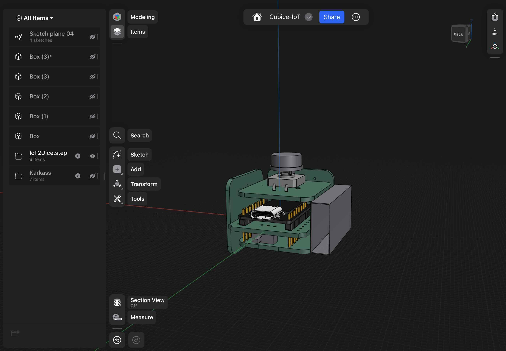
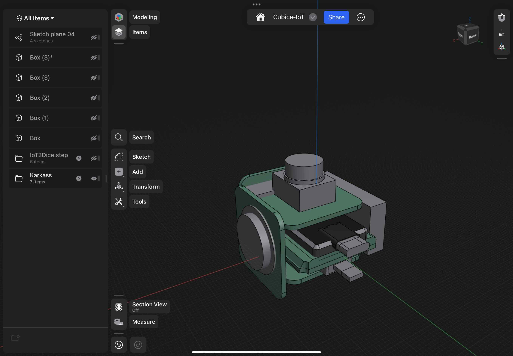
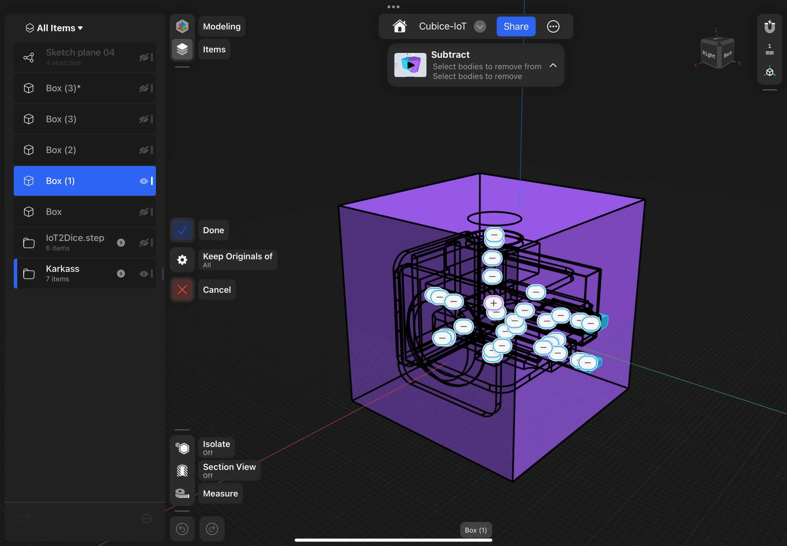
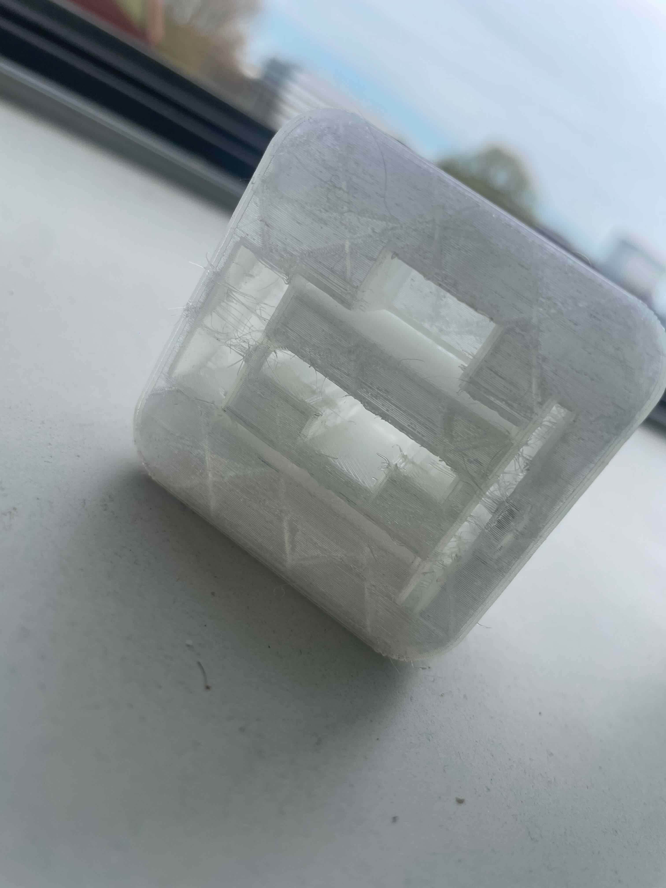

# Concept & Design

## Goal of product
The Goal of this product is to create a interactive and immersive dice-rolling device that enhances traditional tabletop and digital gaming sessions, making it able to play with friends from a distance. 

By giving the user more interaction feedback, like sound and lights, but also a web page with a nice design the iot-dice makes using dices more fun. 

## Target Audience
The IoT-dice is targeted on a audience who likes to play board games with friends & family. And a audience that wants board games to be more exiting!

### user statements 

- As user I want to be able to see what faces i have thrown while playing Yhatzee.
- As user I want to play a board game with my friend living 40 min away from me.
- As a I want to be in suspense when I roll my dice.

## SMART Requirements

### REQ01
**Specific**: The IoT dice shall be able to connect to a designated webpage through a secure Wi-Fi connection.

**Measurable:** The IoT dice shall establish a Wi-Fi connection within 5 seconds of being powered on, as confirmed by successful authentication with the designated webpage's server.

**Achievable:** Utilizing standard Wi-Fi modules and protocols, the dice can establish a connection reliably within the specified timeframe.

**Realistic:** Wi-Fi connectivity is a common feature in IoT devices and can be implemented within the constraints of the dice's hardware and power requirements.

**Time-bound:** The Wi-Fi connection setup is well tested before creating further functionalities. this will be documented  before the end of this project.

### REQ02

**Specific:** The IoT dice shall incorporate motion and orientation sensors to simulate realistic dice rolls.

**Measurable:** The dice is making use of a accelerometer sensor. this sensor measures the the change in speed. when its standing still the only force that is pulling it is gravity. So this is measurable by checking if the accelerometer is still working. 

**Achievable:** By utilizing high-quality inertial measurement units (IMUs) and implementing precise algorithms, the dice can accurately detect motion and orientation.

**Realistic:** Motion and orientation sensors are commercially available and commonly used in IoT devices, making their integration into the dice realistic.

**Time-bound:** The accuracy of dice rolls shall be validated through  testing, with results documented before the end of this project.

### REQ03

**Specific:** The IoT dice shall feature feedback outputs including a LED light and sound to enhance user experience.

**Measurable:** The LED lights shall be capable of indicating in what state the dice is. the sound will indicate when the dice is ready to be thrown and which face is thrown by beeping the amount of numbers that are on the face.

**Achievable:** Integration of RGB LED modules and a small speaker into the dice's design can achieve the desired feedback outputs without compromising its form factor.

**Realistic:** LED modules and miniature speakers are readily available components that can be integrated into the dice's design within reasonable cost and technical constraints.

**Time-bound:** The functionality of LED lights and sound output shall be tested and finalized during the product refinement phase, with any necessary adjustments made within 1 week prior to the product deadline.

### REQ04

**Specific:** The IoT dice shall transmit data related to dice rolls, including timestamp, roll result, and ID, to a designated database hosted on a secure server.

**Measurable:** The database shall accurately record each dice roll event, including timestamp, roll result, and associated user ID, with a data transmission success rate of 99% or higher.

**Achievable:** The dice can reliably transmit roll data to the designated database.

**Realistic**: Using established database technologies the IoT dice can securely store roll data.

**Time-bound:** The database integration and data transmission functionality shall be fully implemented and tested during the product development phase, with any necessary optimizations or improvements completed within 1 week prior to the product deadline.

### REQ05

**Specific:** The IoT dice is a dice that can be rolled to keep the suspense  just like a regular dice. 

**Measurable:** This is measurable By excessive testing during the development phase. The dice should be able to roll on every face an almost equal amount of times. This test will be done at least a 100 times.

**Achievable:** Creating a dice that can roll is achievable by designing a dice that has no access wires hindering the rolling.

**Realistic**: This will be realized by using a micro-controller that can make use of wireless internet communication and battery management. for powering the device and making it portable.

**Time-bound:** The rolling of the iot-dice will be realized and tested before the end of the product deadline

## DIGITAL DESIGN
### Minimalist Design:

Principle: Keep the interface simple and uncluttered.
Explanation: The use of a dark background with a few essential elements (dice, buttons, and text) makes the interface clean and easy to understand. This reduces cognitive load and helps users focus on the primary task of rolling the dice.

### Visual Hierarchy:

Principle: Organize elements to indicate their importance.
Explanation: The dice are prominently displayed at the top center, drawing the user's attention. The "Rolled" button is centrally located and highlighted with a glow effect, indicating its primary action status. The "last throw" and dice selection options are placed at the bottom, providing additional information and choices without distracting from the main action.

### Feedback and Affordance:

Principle: Provide immediate feedback on user actions and indicate interactive elements.
Explanation: The "Rolled" button changes appearance when clicked, giving feedback that an action has been performed. The glow effect around the button suggests that it is interactive. The dice display the results of the last throw, giving users immediate feedback on their actions.

### Consistency:

Principle: Maintain consistency in the design to avoid confusion.
Explanation: The use of consistent colors, fonts, and styles throughout the UI helps users understand and predict how the interface will behave. For example, the dice and buttons share similar visual styles, reinforcing their related functions.

### Contrast:

Principle: Use contrast to highlight important elements.
Explanation: The light-colored dice and buttons stand out against the dark background, making them easily noticeable. This contrast helps guide the user's eyes to the critical interactive elements on the screen.

### Accessibility:

Principle: Ensure the design is usable by as many people as possible.
Explanation: The high contrast between the background and the interactive elements aids users with visual impairments. The straightforward layout and clear feedback mechanisms also enhance accessibility.

### Affordance:

Principle: Design elements to suggest how they should be used.
Explanation: The dice images clearly suggest their purpose, and the "Rolled" button looks clickable, inviting users to interact with it. The dice selection options use color to indicate which number of dice is currently selected, providing a clear visual cue.

### User Control and Freedom:

Principle: Allow users to easily navigate and make choices.
Explanation: The "shuffle Dices" button gives users control over their experience by allowing them to re-roll the dice, providing a sense of freedom and control within the application.- 

### Manufacturing & Material

### Design Process
One hard requirement that i stated for my dice device is that i wanted it to be portable. This means that while the device is in use it does not need any cables to power it or communicate to it.
This was also true for my first design that i created in which i used different components.

