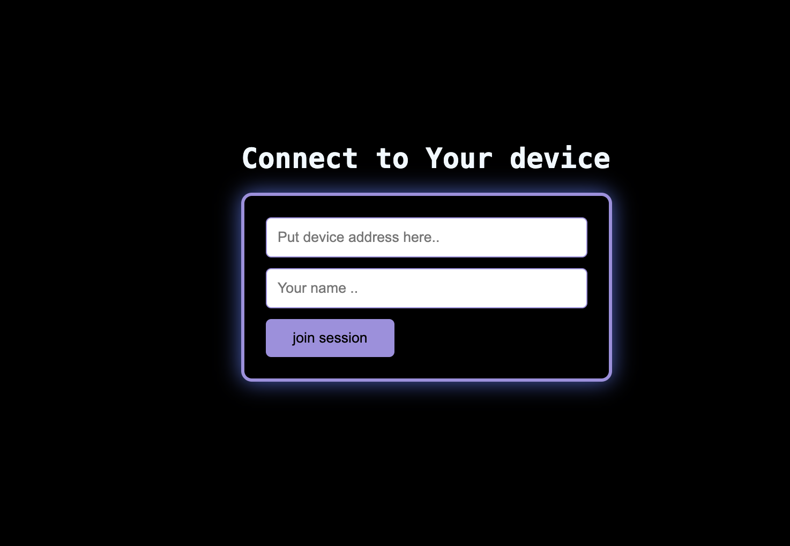
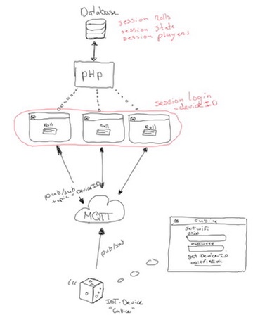

# Web Code

The web-application is a single page application, with beforehand a logging page. So in total there are two pages. In this document I will explain how to navigate trough these pages and what the functionalities are. 

# Style

The complete web-application uses one same style. Therefore CSS (Cascading Style Sheet) is used. The digital design for the web-application is explained in [concept_design.md](../uxd/concept_design.md) but in short, the design is simplistic with a mellow color scheme. all important elements are centered so that it attracts the users eye attention.

I Actually made the decision to use a purple accent color because of a CSS styled button that i found on [uiverse.io](uiverse.io). This is a web-page with example CSS-styled buttons. I was looking for a button to hover over because I did not know how to make one.


This gave me a good example on how to make a button and add features such as 'transform'& 'hover' which I on multiple occasions. Every class under ```.button``` uses this style sheet.

# HTML

The html code is very straight forward, thats why there is not much documentation. The web-application exist out of two pages, a login page and a dice roll page. The login page consist of a ```<form>``` element for the user input and the javascript source path.

The second page has a ```<canvas>``` element for showing a javascript render, a  ```<button>``` to spin the rendered dice and a ```<div>``` that contains the data retrieved from the database.

I did stumble on some troubles with including javascript modules to my html page. In this case the browser does not know where to look for the modules so a import map is needed.

```
<script type="importmap">
    {
        "imports": {
            "three": "./modules/three/build/three.module.js",
            "GLTFLoader": "./modules/three/examples/jsm/loaders/GLTFLoader.js"
        }
    }
    </script>
```


## Log-in Page


First the logging page. The user has to fill in the form to start the session.
The device MAC-address & the players name has to be filled in. How the MAC-address of the dice device is acquired is explained in [embedded/code.](/embedded/code.md)

When the form is filled in and the action function is pressed a function called ```checkform()``` wil be executed. This function checks if the input is valid. 

**It validates:**

1. if input is an empty String
2. if the input is longer then 17 characters
3. if MAC-address input is a valid MAC

For all of these 3 there is a reason. First of almost is validating the input a security measure. I took this decision because of insights that I learned while looking into input forms. 

By validating the input and ensuring it conforms to the expected format casus such as 'a code injection attack' can be prevented.

1. The input should not be empty. after validating the code will be send to the database. the database expects a NOT NULL value in the datatype's where these values will be stored. so checking if the value is not empty is necessary.

2. A MAC-Address is 17 characters, so the form checks if it is not longer. A player name can also nit be longer then 17 characters. the reason for this is the visualization in the next web-page where a long name would be inconvenient.

3. A MAC-address has a format is that is looking like this *'00-00-00-00-00-00'*,  or this *'00x00x00x00x00x00'*. To validate the input on this format a regex is used. If the input complies to the regex is is validated.

```
(javascript)

const macAddressRegex = new RegExp(/^([0-9A-Fa-f]{2}[:-]){5}([0-9A-Fa-f]{2})|([0-9a-fA-F]{4}.[0-9a-fA-F]{4}.[0-9a-fA-F]{4})$/);
```
If one of these checks is false the web-page will trigger an alert.
```
(javascript)

if (device == "" || player == "") {
        alert("Ensure you input a value in both fields!");
        isValid = false;
}
```

### login  API 

The input from the form is inserted from the web-page to the database using a API. This API is the backend of the web-application written in PHP. The API gets accessed trough a Javascript *'fetch'* method.

The validated input values;  ```'device'``` & ```'player'``` are posted to [form.php](../../web/php/form.php). In form.php the data is forwarded to the database.

```
(javascript)
    formData.append('player_name', player);
    formData.append('device_id', device);

    if(checkForm()){
        fetch("./php/form.php", {
            method: "POST",
            body: formData,
          })
    ....
```

### form.php

This PHP script essentially acts as a backend API endpoint handling HTTP POST requests, performing database operations, and managing session data, all of which are typical features of an API that facilitates communication between a web application and a database.

Here’s a breakdown of the script and how it functions as a API:

**Session Management:** 

The script starts a session using ```session_start()``` and stores user-specific information like ```player_name``` and ```device_id``` in session variables.

**Database Connection:** 

The script includes a database connection from [db_connect.php](../../web/php/db_connect.php), which contains functions for opening and closing the database connection ```OpenCon()``` and ```CloseCon()```.

**CRUD Operations:**

***Insert Device:*** The ```insertDevice()``` function inserts a new ```device_id``` into the *'device_session'* table.

***Insert Participant:*** The ```insertParticipant``` function inserts a new participant associated with a ```device_id``` into the *'session_participants'* table.

***Check Device Existence:*** The ```isDeviceExists()``` function checks if a ```device_id``` already exists in the *'device_session'* table.

***Main Logic:*** The ```handleInsertion()``` function coordinates the insertion process. It checks if the device exists and inserts it if it doesn’t, then inserts the participant and redirects to the main page upon successful insertion.

***Form Handling:*** The script handles only POST requests (form submissions), retrieves form data, sets session variables, and calls the main insertion function.

```
if ($_SERVER["REQUEST_METHOD"] === "POST"){

}
```


## Main Page

The way that the code is working is based on the architecture design. The reasons for choosing this design are explained in the [ technical documentation](../web/technical_documentation.md). 
The dice device and the web-application clients are connected through a MQTT broker. The dice device has no access to the back-end API.



### Main.js
Javascript is the most important part of te website in this design. To connect to the database a JS script fetches data from the back-end. For connecting to the MQTT broker an external JS MQTT library is used. And to render and load the 3D dice into the web-page an copied JS module from Three.js is used.

Thats why I decided to make a main javascript file where all these functions are implemented from out of Javascript files that contain these separate purposes.

```main.js``` is responsible for handling the front-end functionality of the web application that interacts with a back-end server and an IoT MQTT client. It fetches session data, sets up the MQTT client, manages UI updates for device connectivity and status, and handles user interactions such as button clicks.

#### 1. Fetching Session Data on Page Load
```
document.addEventListener("DOMContentLoaded", function() {
  fetch('./php/getSessionData.php')
    .then(response => response.json())
    .then(data => {
      if (data.device_id) {
        console.log("Device ID from session:", data.device_id);
        console.log("user from session:", data.player_name);
        session_id = data.device_id;
        session_player = data.player_name;
        setupMqttClient(String(session_id));
        anim();
      } else {
        console.error("Error:", data.error);
      }
    })
    .catch(error => console.error('Fetch error:', error));
});

```
**Purpose:**

Fetch session data from the server when the document is fully loaded.

**Actions:**

- Retrieves session data from getSessionData.php.
- Logs the device ID and player name.
- Stores these values in session_id and session_player.
- Sets up the MQTT client with the device ID.
- Calls the anim function to handle animations.

#### 2. Button Click Event Listener
```
document.addEventListener('DOMContentLoaded', function () {
  const button = document.getElementById('spin');
  button.addEventListener('click', function () {
    fetchLastInsertedRow();
    publishRoll(session_id, 'Rolling Loud!')
  });
});

```
**Purpose:** 

Add an event listener to the "spin" button to handle clicks.

**Actions:**

- Fetches the last inserted row from the database.
- Publishes a roll action message with the session ID.

#### 3. Fetch Last Inserted Row
```
function fetchLastInsertedRow() {
    fetch('./php/roll.php')
    .then(response => response.json())
    .then(data => {
        console.log(data.lastInsertedRow.player_name);
        displayLastInsertedRow(data.lastInsertedRow);
    })
    .catch(error => console.error('Error:', error));
}
```
**Purpose:**

 Fetch the last inserted row from the database.

**Actions:**

- Makes a request to roll.php.
- Logs the player name from the last inserted row.
- Calls displayLastInsertedRow to update the UI.

#### 4. Display Last Inserted Row
```
function displayLastInsertedRow(rowData) {
    const data = JSON.parse(rowData);
    const playerName = data.player_name;
    const rolledNumber = data.rolled_number;
    const throwTime = data.throw_time;

    document.getElementById('player').innerHTML = 'player: ' + `${playerName}`;
    document.getElementById('rolled').innerHTML = 'rolled: ' + `${rolledNumber}`;
    document.getElementById('time').innerHTML = 'time: ' + `${throwTime}`;
}
```
**Purpose:**

Display the last inserted row's data on the UI.

**Actions:**

- Parses the row data.
- Updates the HTML elements with the player name, rolled number, and throw time.

#### 5. Periodic Device Connectivity Check
```
let messageReceived = false;
let count = 0;

document.addEventListener('worldMessageReceived', function(event) {
    console.log('Received in main.js:', event.detail.message);
    messageReceived = true;
});
```
```
function areYouThereInterval() {
    if (messageReceived) {
        console.log('Message was received, resetting counter.');
        messageReceived = false;
        count = 0;
    } else {
        count++;
        console.log(`No message received yet. Attempt ${count}`);
    }
    if (count >= 2) {
        endRotation();
        clearInterval(intervalId);
        console.log('Interval cleared');
    } else {
        publishAreYouThere(session_id, 'hallo');
        publishBattery(session_id, 'here i ask the battery status');
        document.getElementById('batteryStatus').innerHTML = 'Battery: ' + `${batteryPercentage}` + '%';
    }
}

const intervalId = setInterval(areYouThereInterval, 5000);
```

**Purpose:**

 Regularly check if the device is still connected and request the battery status.

**Actions:**

- messageReceived to true when a message is received.
- If a message was received, reset the counter and message flag.
- If no message was received after two attempts, stop the interval and end the rotation. Otherwise, publish messages to check device connectivity and request battery status.
- Update the battery status in the UI.

### 3D Object
For the rendering of the object I used the Three.js. Three.js.
To render the [3D dice](../assets/web/blenderDice.png) asset that I made myself a couple of Three.js objects have to be created. The Three.js library is a object orientated lib. This makes It easy to understand the code. To create these objects I used the documentation that you can find on [threejs.org/docs](https://threejs.org/docs/). The objects speak for itself:

- ```THREE.Scene()``` (Scene)
- ```THREE.PerspectiveCamera()``` (Camera)
- ```THREE.WebGLRenderer()``` (Renderer)
- ```GLTFLoader()``` (Object Loader)
- ```HREE.AmbientLight()``` (Ambient Light)
- ```THREE.DirectionalLight()``` (Directional Light)

The *'Scene'* is the parent object, every other object that is needed to visualize the 3D dice is a child object of the *'Scene'* apart from the *'renderer'* which renders the Scene.

```
scene.add(camera); 
scene.add(ambientLight);
scene.add(directionalLightBottom);
scene.add(directionalLightUp);

// loads the 3D object in the Scene
const loader = new GLTFLoader();
loader.load('../assets/Dice.glb',function(gltf){
                cube = gltf.scene;
                scene.add(cube);
                cube.position.set(0, 0, 0);}, 
                ....
                );
```
```
renderer.render(scene, camera);
```

The Render needs a place in the HTML page where it can render the Scene, this is given by the javascript document query selector.
```
//Canvas
const canvas = document.querySelector('canvas.webgl');

const renderer = new THREE.WebGLRenderer({
    canvas:canvas //Give canvas to webgl canvas element
});
```
### Animation

To animate the 3D dice rotating there is made use of ```window.requestAnimationFrame()``` function. This method is a web API that tells the browser to call a specified function to update an animation before the next repaint. 

This method helps create smooth animations by synchronizing updates with the display refresh rate, typically 60 frames per second (fps) on most devices. This ensures the animation is as smooth as possible.

The specified function that is called is ```anim()```

```
export function anim(){
    const currentTime = Date.now();
    const deltaT = currentTime - time;
    time = currentTime;

    if (cube) {
        if (isRotatingToFace) {
            transitionElapsed += deltaT;
            const fraction = transitionElapsed / transitionDuration;
            if (fraction < 1) {
                cube.quaternion.slerp(targetQuaternion, fraction);
            } else {
                cube.quaternion.copy(targetQuaternion);
                isRotatingToFace = false; // End rotation to face
            }
        } else if (enableRotation) {
            const rotationAmount = deltaT * rotationSpeed; // Calculate rotation based on deltaT
            cube.rotateOnAxis(rotationAxis, rotationAmount);
        }
    }

    renderer.render(scene, camera);
    window.requestAnimationFrame(anim);
};
```

Because I only animate the rolling of the dice I made a time delay that will spin the object until the application received a rolled value from the MQTT subscription. after that it wil rotate to the target quaternion.

To calculate the distance from the current quaternion to the target quaternion the ```.slerp``` method is used. SLERP, or Spherical Linear Interpolation, is a method for interpolating between two quaternions. In the context of 3D graphics and animations, SLERP is commonly used to smoothly interpolate rotations.


### MQTT

For connecting to a broker on the iot-docker I used a npm module [mqtt.min.js](https://cdn.jsdelivr.net/npm/mqtt/dist/mqtt.min.js). you can find the source in *main.html*.
```
<script src="https://cdn.jsdelivr.net/npm/mqtt/dist/mqtt.min.js"></script>
```
I connected with the mqtt broker trough a websocket connection on the localhost. 
```
const brokerUrl = 'ws://localhost:9001';
const client = mqtt.connect(brokerUrl, {
  username: 'iot-web',
  password: '7YKyE8R2AhKzswfN',
  keepalive: 60,
  reconnectPeriod: 5000,
  clean: true,
});
```
I was unable to create a dns for the broker, so I had to use the localhost. The only problem is that this means that the client is only able to find the broker when its on the host device.

I Struggled a long time to find a solution for this by trying to change the docker tunnel config. I did not come to a solution but thanks to a classmate I came to the understanding that the "NGIX Tunnel" did not allow an extra port for an MQTT portal and that he used another docker tunnel. 

#### subscription
There are 3 topics that the web-clients are subscribed to to communicate with the session-dice. The session-dice is the device_id that is stored in session storage after filling the form in the login page.

```
 // Define topics based on session_id
  const topics = {
    world: `cubice/${session_id}/web/world`,
    rolled: `cubice/${session_id}/web/rolled`,
    battery: `cubice/${session_id}/web/battery`
  };
```
the session_id is cooked in the topic so that all clients are directly subscribed to the device in question.

an example of session_id = *74:4D:BD:B0:27:10*

The topic subscription would then be ```cubice/74:4D:BD:B0:27:1/web/world```, the subtopic ```/web``` is to indicate that it is the web client that is subscribed.

##### Subscribe Topics
- ```/world```, On this topic the web client receives a "hello world" message if the session device is connected!
- ```/rolled```, On this topic the rolled value is published from out of the session device.
- ```/battery```, On this topic the battery status from the device is published.

After the client receives a message of one of these topics a handle function is called to start the execution, for example for handling the rolled message that sends the data to the database and stops the animate function.
```
function handleRolledMessage(message) {
  console.log('Rolled message received:', message);
  rotateToFace(message);
  const date = Date.UTC();
  const formData = new FormData(this);
formData.append('rolled_number', message);
formData.append('date_time', date);
  // send message immediately to db
    fetch("./php/roll.php", {
        method: "POST",
        body: formData,
    })
    .then(response => {
        if (!response.ok) {
            throw new Error("Network response was not ok");
        }
        return response.text();
    })
    .then(data => {
        
        console.log(data); // Response from PHP script
    })
    .catch(error => {
        console.error("There was a problem with the fetch operation:", error);
    });
}
```

##### Publish Topics
There are also topics to publish messages to the broker for bidirectional communication. The ```/dice``` indicates that on this topic the dice device is the one that is subscribed. 

- ```cubice/${session_id}/dice/roll```, On this topic the client publishes that the roll button is pressed.
- ```cubice/${session_id}/dice/areyouthere```, This topic is used to publish a are you there message, kind of a probe to check if the device is already online.
- ```cubice/${session_id}/dice/battery```, On this topic the web-client asks for the battery status.
