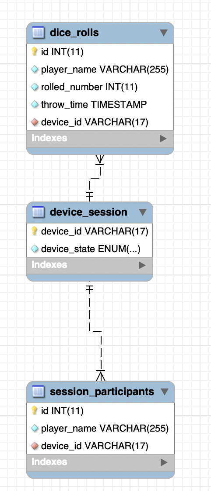
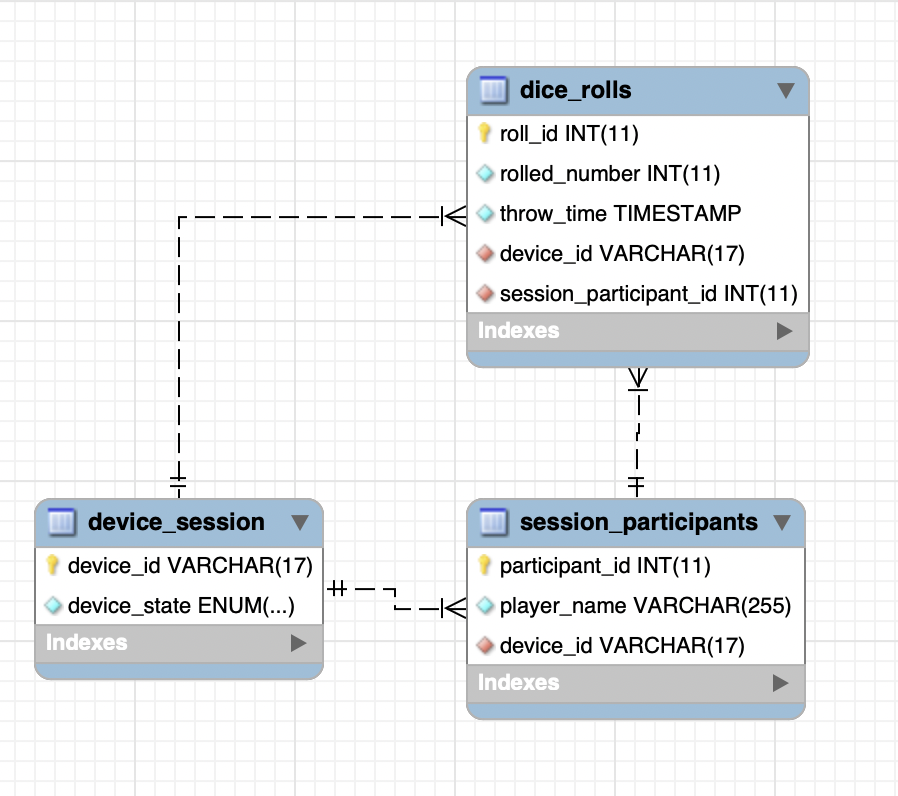

# Database

On this page I will describe the database structure of the web-page and how to set a database up and create an user. 

# Architecture Design
The dice is a device intended to be used when playing with some friends or a group. With this in mind the design of the database is made to store essential data when playing a session with the dice.

To make sure that multiple clients can make use of the same dice and play a game together a session has to be created. 

a session typically refers to a period of time during which a player interacts with the game. It starts when the player logs in or starts playing and ends when they log out or stop playing. Sessions are needed in a database for playing with multiple people because they help manage the state of each player's interaction with the game.

To identify the clients/players that are logged into the session a the database should also store the players that are connected to a session. 

of course as last the sensor data of the dice has to be stored for results and analyses. 

This adds op of a total of three tables that has to be stored in the database. 

- Device Session
- Session Participants
- Dice Sensor Data


## Database Tables 

### device_session

The table **'device_session'** holds the important data that is needed for the session. An example is when the web-page is re-loaded the client should be able to retrieve the **'device_id'**, the id of the device it has to connect to. And the 'device_state' the state in which the device is in.

#### - Primary key
For the session on the web-page a unique identifier is needed to connect the clients/players to the session. The primary key is the **'device_id'**. Reasoning for this is that there is only one device used in a session. Sins the device has a unique identifier of itself ( a MAC address), this is used as the session id. 

A MAC address has 17 characters, thats why the primary key is a **VARCHAR(17**).
```
`device_id` varchar(17) NOT NULL,
 PRIMARY KEY (`device_id`)
```

#### - Device state

The device makes use of states. There are different states on the device that must be paid attention to during the session. The states may indicate **'waiting', 'ready', or 'rolled'**. Because the states give a indication in which state the device is in the session has to keep track of it, thats why this datatype is added in this table.

```
`device_state` enum('waiting','ready','rolled') NOT NULL
```


### dice_rolls

The table **'dice_rolls'** holds the dice values of session participants that rolled the dice. This is a important table that stores sensor data in the database. This table also has the most information value because different functionalities applied using this data, such as the participants amount of rolls, the amount of times a participant rolled a specific number, or teh last time a dice is rolled.

#### - Primary key

This table has a primary key to identify which roll it was because every roll is unique. It also keeps track of the **'device_id'** as foreign key, because the device that is rolled also has to be stored to know in which session it is used.

#### - player name 

Player name keeps track of the participant that has thrown the dice. this value is stored on the client-side handy for visualizing the participants thrown dice rolls on the client-side. It is not used as primary key because participants kan choose to have the same name. 

- Datatype: 
 **VARCHAR** These datatypes are flexible and can accommodate names of varying lengths. They are suitable for most applications where the length of the player names is relatively predictable but might vary

```
`player_name` varchar(255) NOT NULL,
```
** player_name can not be null, not because it is a primary key but because the name of the player has to be visualized on the client-side of the web-page.

#### Rolled number

In this datatype the sensor value is stored. For Calculating the orientation of the dice quaternions are used. The idea was to store these values in the database to also record the motion that the dice had made. But sins this would get to complicated I chose to only use acceleration data to measure the face of the dice that is laying down and convert into an int value from 1 to 6. These are the values that are stored in the database.

- Datatype:
**INT** An int datatype allows you to represent the result of a dice roll numerically.Integer datatypes are efficient in terms of storage space and processing. Storing dice rolls as integers typically requires less space compared to other datatypes like strings.

```
`rolled_number` int(11) NOT NULL,
```

#### Throw time

This datatype is used to tell the time at which the dice was rolled.
- Datatype: 
The datetime datatype allows you to store date and time values with precision up to milliseconds (depending on the database system). This level of accuracy is essential for applications that require precise timestamping of events or transactions.

```
 `throw_time` timestamp NOT NULL DEFAULT current_timestamp(),
```
** The throw_time will automatically be filled in by the current_timestamp() function. so it is not necessary fill in a timestamp in a query. 

### session_participants

#### Primary key
As described earlier the 'player_name' cannot be used as a primary key because participants may have the same name and there is no benefit from denying participants of having the same name. Thats why 'id' is the primary key in this table.

```
`id` int(11) NOT NULL AUTO_INCREMENT,
PRIMARY KEY (`id`),
```

#### Device id

While logging in the player has to choose a name and of course fill in the device that it wants to connect to. For this reason the **'device_id'** is a foreign key in session_participant.

```
`device_id` varchar(17) NOT NULL,
KEY `session_participants_ibfk_1` (`device_id`),
```

## Relations

- **'device_session'** -> One to many **'session_participants'** *(Optional)*
- **'device_session'** -> One to many **'dice_rolls'** *(Optional)*


# Design Options

In this architecture there where some design options. Some are to simplify the project based on the limited amount of time, and some to improve.

**1. Only one dice can be used per session**

Adding multiple devices to the session is a great feature that would make sense for a dice game but this would cause for unnecessary complexity in different levels of of the project which would lead to a longer developing time.

If the use of multiple devices would be implemented it could be done by adding a datatype in **'device_sesion'** called **'session_id'**. This way the primary key is **'session_id'**, and the **'device_id'** would still be a foreign key to the other tables.


**2. Not splitting device and session in separate tables**

As described earlier the reason why I did not make a separate table for session and device is that they are 'one to one' if the architecture would be a bit more complex by using multiple devices or using different type of sessions this would not be the case.

**3. session deletion**

When a session is closed, all of the rows related to that session will also be deleted from the database. Over time, databases accumulate unnecessary or obsolete data. Deleting records helps keep the database clean and efficient by removing redundant, outdated, or irrelevant information.

```
  CONSTRAINT `dice_rolls_ibfk_1` FOREIGN KEY (`device_id`) REFERENCES `device_session` (`device_id`) ON DELETE CASCADE

  CONSTRAINT `session_participants_ibfk_1` FOREIGN KEY (`device_id`) REFERENCES `device_session` (`device_id`) ON DELETE CASCADE
```
ON CASCADE DELETE in a database allows you to automate the deletion of related records in child tables when a record in the parent table is deleted. This can be highly useful for maintaining data integrity and ensuring that your database remains consistent.

In short every row in **'dice_rolls'** & **'session_participants'** that has the foreign key wit the the same **'device_id'** that is removed will be deleted.


## ER Diagram
This is a Entity Relationship Diagram, it is a normalized diagram that shows the relationship between the tables of a database. 



## How to Recreate this database
To recreate this database you have to create a root user in the PhpMyAdmin server running in the project docker. 
After creating a user create a new scheme called iot-dice. Click on the scheme created and navigate to the **Import** tab. Drop in [this .sql file](../../iot-dice.sql) under 'File to Import' to create the tables.
## Findings

As you may already have seen in the UML Diagram there is a redundancy taking place. The **'player_name' (datatype)** is implemented twice in this database. Because of some feedback that I gained I found this minor imperfection and corrected the database. Unfortunately this was to late in the process so I had not enough time to implement it in the working version of the IoT-Dice. 

The reasoning why I did not use the **'player_name' (datatype)** as a foreign key is that it would be difficult to keep track of unique player names. Now the table **'dice_rolls' (table)** uses the **'participant_id' (datatype)** of **'session_participants' (table)** this way every roll is linked to the participants id instead of name.

So there should be an extra relation: 
- **'session_participants'** -> One to many **'dice_rolls'**




To use this version in the project you can use the [this .sql file](../../iot-dicev2.sql) to create the scheme.

