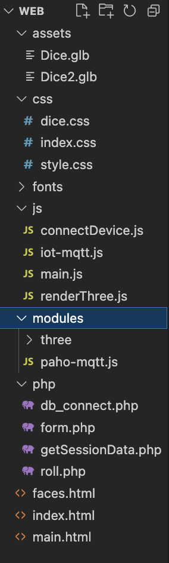
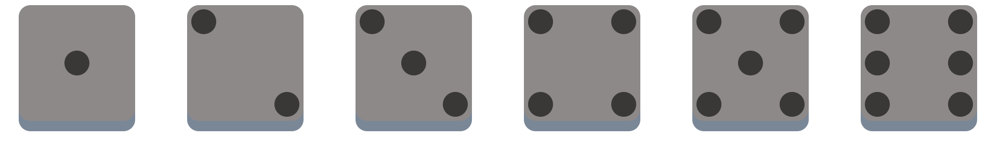
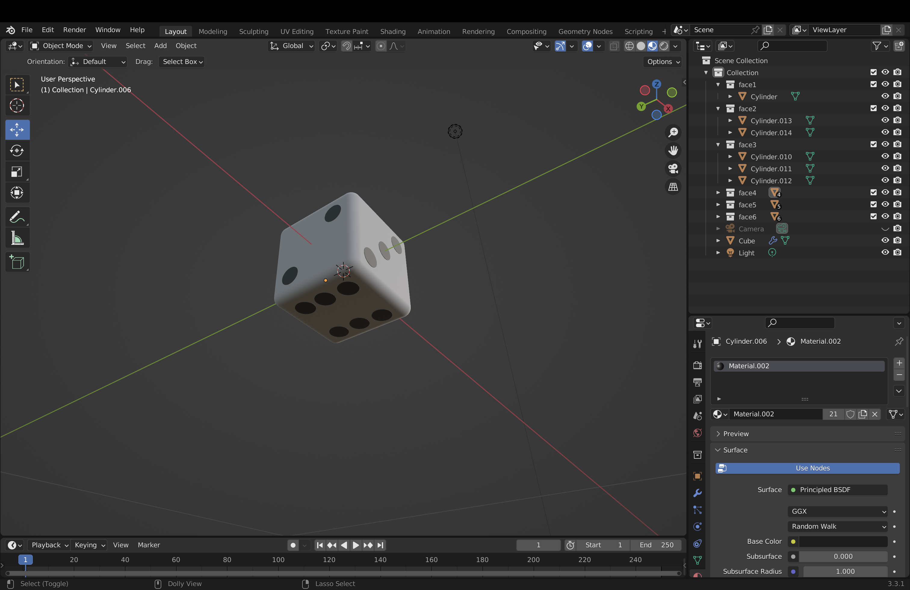
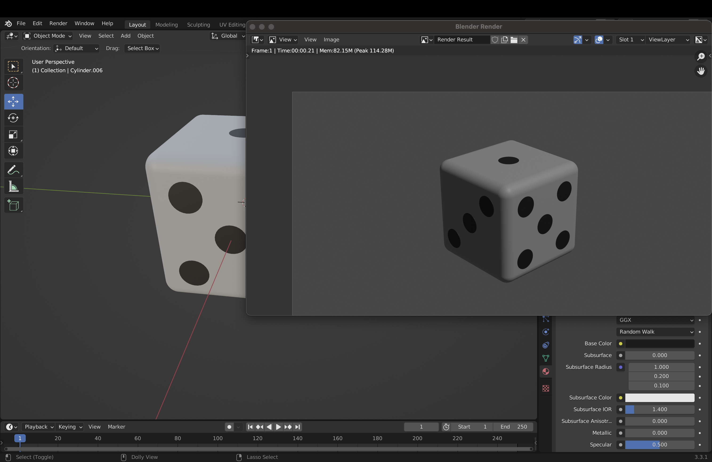
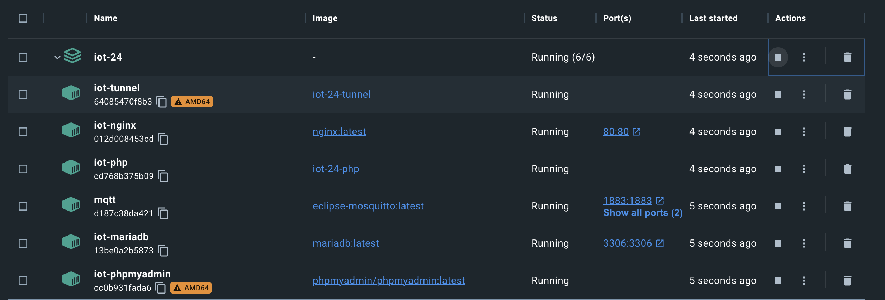

# Technical Documentation

## Tools Used

#### Visual Studio Code
I worked in VScode to program and test the webapp, VScode has many extensions that you can use out of to test and build web pages. I used the Live Server extension for designing the web pages.  

#### Docker
Docker is the place where all servers and the MQTT broker. 

#### Blender
I used blender to design and create an 3D dice asset

#### MySQLWorkbench
I used MySQLWorkbench to create an ER diagram this normalizes and visualized the scheme

### MyPhpAdmin
I used MyPhpAdmin to write the SQL queries to create and test my database


## Project Structure 
As you can see in the page below is the project folder. It is structured in such a way that the CCS files are under CSS, Javascript files under JS and PHP files under php. This keeps the project folder tidy and clear.




## Web architecture
underneath You can see the web architecture. I chose this design with using MQTT because I would like to learn how it works and after some research think that this is the best way to connect the dice device to a webapp. Instead of using an REST API to store the data on a database or back-end the end-user has a real-time connection with the device via a broker. 


Multiple webapp users can connect to the device by subscribing to a topic using the device id. the users can also simultaneously publish messages to the device without worrying about the back-end. The back-end API is only used to store the data that the device has published into the database.

### API

The data from the dice that is rolled is posted to ```roll.php```. When a thrown rolled value is posted to ```roll.php``` it is inserted into the data and the last inserted roll value is echoed out. 

***The Rolled value that is posted to roll.php has to be an  value between 1 and 6***
```
if ($_SERVER["REQUEST_METHOD"] === "POST") {
    
    // Get form data
    $rolled_number = $_POST["rolled_number"];


    $conn = OpenCon(); //Open db connection

    $lastInsertedRow = handleInsertion($rolled_number,$device_id,$player_name, $conn);

    // Output the last inserted row as JSON
    echo json_encode($lastInsertedRow);
    echo json_encode(['lastInsertedRow' => $lastInsertedRow]);

    CloseCon($conn); //Close db connection

}
```

The ```handleInsertion()``` method handles the insertion and selecting of the last row. It will return the last rolled dice.

```
function getLastInsertedRow($conn) {
    $query = "SELECT * FROM `dice_rolls` ORDER BY id DESC LIMIT 1";
    $result = mysqli_query($conn, $query);
    return mysqli_fetch_assoc($result);
}
```
```
function handleInsertion($rolled_number,$device_id,$player_name, $conn) {

    if (isDeviceExists($device_id, $conn)) {
        // Insert device_id into devices table
        insertRoll($rolled_number,$device_id,$player_name, $conn);
        return getLastInsertedRow($conn);

    }

}

```
The function  ```fetchLastInsertedRow()``` in ```'main.js'``` fetches the last inserted row from the API.
```
function fetchLastInsertedRow() {
    fetch('./php/roll.php')
    .then(response => response.json())
    .then(data => {
        console.log(data.lastInsertedRow.player_name);
        // Here, data contains the last inserted row from the PHP file
        displayLastInsertedRow(data.lastInsertedRow);
    })
    .catch(error => {
        // Handle any errors that occur during the fetch request
        console.error('Error:', error);
    });
}
```
# Front-End

The front-end refers to the part of the web application that users interact with directly. It encompasses everything that users see and experience in their web browser, including the layout, design, and interactivity of a site. The primary technologies used in front-end development are HTML, CSS, and JavaScript

In this part I will explain the Tools and languages that I used to create the front-end of the web-application. 


## Javascript

### Three.js

In the web-application I wanted to visualize the dice device and the way it rolls. This makes the webapp more interesting for the user and brings some complexity to the whole project. 

My first idea was to create it in HTML & CSS alone. I used a tutorial on how to make HTML & CSS dice and the results where as follow: 


The html code for this is the [faces.html](../../web/faces.html) file, and [dice.css](../../web/css/dice.css) is the style sheet. This was my first way of visualizing the dice results.  But doing it this way I found it difficult to load these dices in and out of the web-page because it is basically html element blocks. second problem is that these dices are static and do not simulate the rolling of a dice. thats when I found out about javascript object rendering.

I chose to use Three.js, it is a popular JavaScript library used to create and display 3D graphics in a web browser. It leverages WebGL (Web Graphics Library) for rendering, which allows for high-performance graphics by utilizing the power of the GPU (Graphics Processing Unit). Here are some key points about Three.js

1. ***3D Graphics Creation:**** Three.js provides an easy-to-use interface to create complex 3D scenes, including geometries, materials, lights, and cameras.

2. ***Animation:*** It supports animation, enabling developers to create dynamic and interactive 3D animations directly in the browser.

3. ***Cross-Platform:*** Since it's JavaScript-based, it works across all modern web browsers and doesn't require any plugins.

4. ***Extensive Documentation and Community:*** Three.js has comprehensive documentation and a large community, making it easier for developers to find resources, tutorials, and examples.

5. ***Integration:*** It can be integrated with other libraries and frameworks, such as React, allowing for more complex and feature-rich applications.

I downloaded the latest stable version of Three.js form github [here](https://github.com/mrdoob/three.js.git), instead of using the ***npm*** library package manager that is most often recommended on the internet.

When I used the module that was installed with ***npm*** my html file could not find the Three.js package for some reason, thats why i downloaded the whole module locally in the project folder using git.


### Creating a 3D dice object

To load a 3D object in my web-page I first needed to have a 3D dice. This could be done in three ways:
- Create an object with three.js, basically write code to make a dice
- Find an 3D dice with the right format on the internet and load it in with one of the Three.js ```objectloader()``` methods.
- Create my own 3D dice object and load the created asset in with one of the Three.js ```objectloader()``` methods.

I chose for the latter one because I wanted to learn how to work with Blender. I used a tutorial on youtube on how to create an dice, you can find the link to the tutorial over [here](https://www.youtube.com/watch?v=fD67CJClSaE).

I stumbled onto a problem with loading the 3D object, on a smaller device the browser could not handle the file size of the  asset that was loaded in. To increase the performance and loading time I decreased the subdivisions of the 3D dice that I created. This means less vector points so the down side is a dice with a lower resolution but an increase in improvement. 

You can see the difference in file size in the folder web/assets between [Dice.glb](../../web/assets/Dice.glb)*(2.4MiB)* & [Dice2.glb](../../web/assets/Dice2.glb)*(167.3MiB)*.

#### Format
There are multiple formats to choose for transporting the 3D object from blender to the webapp. I chose to use for the **'GLTF/GLB'** format because it has a wide compatibility  and it is optimized for web performance.





## MQTT
For this project there is chosen to use MQTT instead of an REST API communication between th device and the webapp. MQTT (Message Queuing Telemetry Transport) is a lightweight messaging protocol designed for constrained devices and low-bandwidth, high-latency, or unreliable networks. It is commonly used in IoT (Internet of Things) applications because it enables efficient, reliable, and real-time communication between devices. MQTT operates on a publish/subscribe model, which allows devices to communicate with minimal overhead, making it ideal for scenarios where bandwidth and power consumption are critical concerns. Its simplicity and efficiency in handling large numbers of devices with low data rates make it a popular choice for connecting sensors, actuators, and other IoT devices to centralized systems or cloud platforms.

#### Advantages of MQTT over REST API
**Real-Time Communication:**

- *MQTT:* Designed for real-time, bi-directional communication. Ideal for IoT applications requiring low latency and instant updates.

- *REST API:* Typically follows a request-response model, which can introduce latency and is not inherently real-time.

**Efficiency and Overhead:**

- *MQTT:* Lightweight protocol with minimal overhead. Suitable for devices with limited resources and bandwidth constraints.

- *EST API:* HTTP-based, which has higher overhead due to headers and more complex request-response cycles.

**Connection Management:**

- *MQTT:* Maintains persistent connections with a keepalive mechanism, reducing the need for frequent 'reconnection'.

- *REST API:* Stateless, meaning each request opens a new connection, which can be less efficient for continuous data streams.

**Publish/Subscribe Model:**

- *MQTT:* Uses a publish/subscribe model, allowing multiple clients to subscribe to topics and receive updates as they occur.

- *REST API:* Uses a point-to-point model, requiring clients to poll the server for updates, which is less efficient and can lead to delays.

**Scalability:**

- *MQTT:* Easily scalable due to its lightweight nature and efficient use of network resources.

- *REST API:* Can become less efficient as the number of clients increases, particularly with frequent polling.


To make use of an MQTT in the project an broker server is needed. The MQTT broker is the backend system which coordinates messages between the different clients. I first looked for an online broker. A free broker that I stumbled on was [HiveMQ](https://www.hivemq.com/). But unfortunately7 this did not work out because of the difficulties that I had with setting up the connection to th online broker. You can only connect to a online HiveMQ broker by using a secured connection using SSl. For begin stages of testing my project I found this way to difficult to to delve into. 

A MQTT broker can also be hosted on a docker container. I finally decided to do it this way sins there is already a docker container running for the web-server and the database. by doing it this way it is more clear which server systems are needed to run this project and I have more capabilities in changing settings.



To configure the mqtt broker so that it can work on a websocket port and a normal port I used these these configurations.

```
password_file /mosquitto/config/pwfile
listener 1883 
listener 9001
protocol websockets
```
The website has access to the docker broker by using the the server URL. In the case of this project the local host is the server URL. but this means that the connection from the webapp to the broker wil only work the host device. I tried to change this by making a tunnel for the MQTT broker so that other devices could also connect to it.
```
const brokerUrl = 'ws://localhost:9001';
```
I Struggled a long time to find a solution for this by trying to change the docker tunnel config. I did not come to a solution but thanks to a classmate I came to the understanding that the "NGIX Tunnel" did not allow an extra port for an MQTT portal and that he used another docker tunnel. This has recently not bin updated yet.


